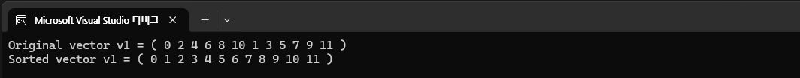
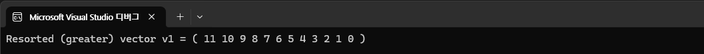
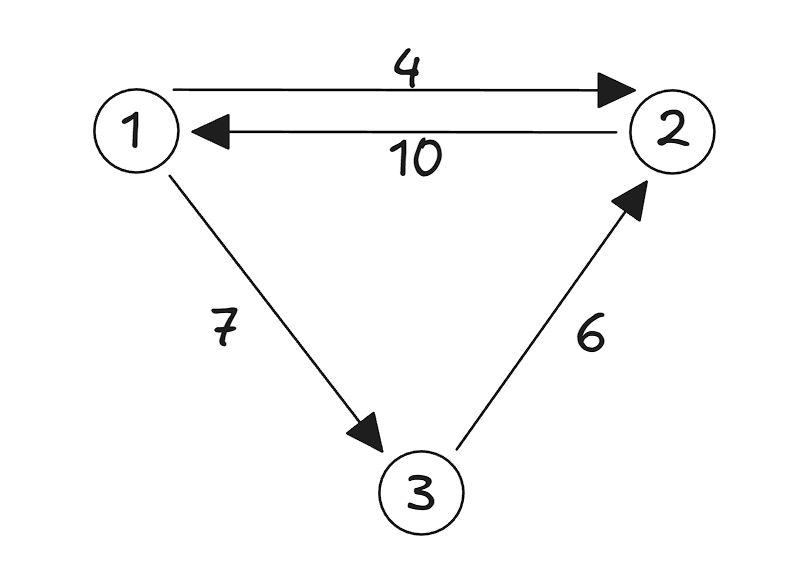
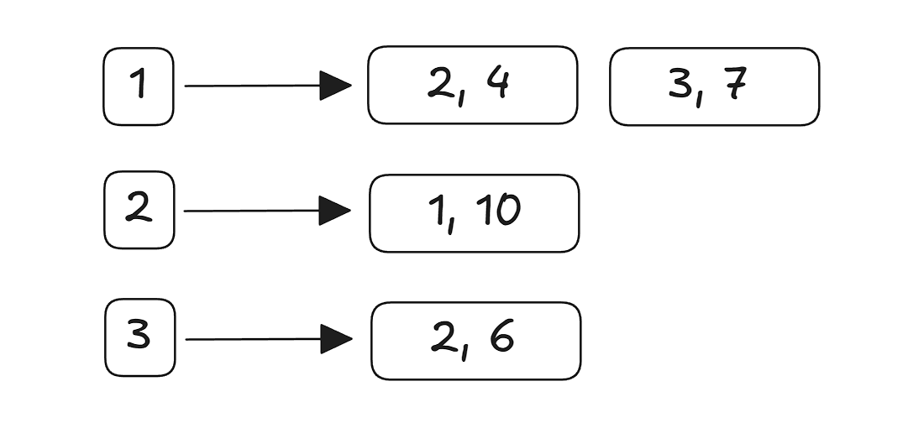
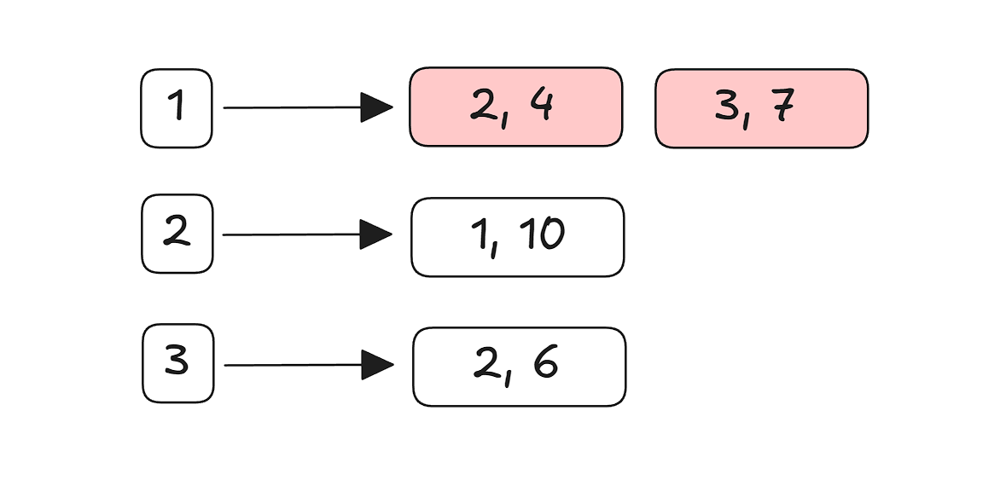

# 3-1 예상치 못한 음수 결과 해결하기

문제를 풀다가 예상치 못한 이상한 음수 값을 마주할때가 많다.
다양한 이유가 있겠지만, **조건이나 수식에 오류**가 있거나 **변수의 자료형이 적절하지 않아 범위를 초과**할 때 자주 나타난다. (오버플로우/언더플로우)

실제로 숫자 데이터를 다룰 때 가장 익숙하게 사용하는게 `int`형인데, `-2,147,483,648 ~ 2,147,483,647` 범위의 수를 담을 수 있다!
따라서 21억을 넘어가는 수를 담아야 할 때는 `unsigned int` 혹은 `long`을 사용하는 것을 고려해보면 좋겠다.

# 3-2 시간 초과의 원인을 찾아 해결하기

시간 초과로 인해 테스트 케이스 실행 결과 실패하는 경우가 정말 많다.
이럴때는 입력/출력 방식부터 최적화할 수 있는 지 점검해보는 것이 좋다. (가장 시간 소요가 큰 작업이 입출력이니까!)

`cin`, `cout` 대신 `printf`, `scanf` 를 사용하면 입출력 처리 속도를 크게 향상시킬 수 있고, C++ 스타일대로 사용하고 싶다면 다음과 같이 해결할 수 있다.

```cpp
int main() {
  ios::sync_with_studio(false);
  cin.tie(NULL);
}
```

### C와 C++ 동기화 끊어주기

위 코드에서 `ios::sync_with_studio(false)`는 C 의 stdio 와 C++ 의 iostream 간에 동기화를 비활성화하는 작업이다. 이렇게 해주면 C++의 입출력이 C의 입출력과 독립적인 버퍼로 동작해서 cin과 cout의 속도가 크게 향상된다고 한다!

그리고 이렇게 사용할 경우 C/C++ 입출력을 혼용할 경우 버퍼링 문제로 예상하지 못한 문제가 발생할 수 있어서, 둘 중 하나로 통일해서 사용하는 것이 좋다고 한다.

### cin과 cout 연결 끊어주기

그리고 `cin.tie(NULL)`은 기본적으로 묶여있는 cin 과 cout 의 연결을 끊는 함수다. C++에서는 cin이 호출되기 전에 cout의 버퍼를 자동으로 비우도록 보장되어 있다. 그러나 이 연결을 끊어버리면 cout을 자동으로 flush하는 걸 생략해서 입출력 속도가 더 빨라지게 된다!

물론 멀티 스테드 환경이나 실시간 화면 출력이 중요한 환경에서는 잘 사용하지 않지만, 코딩테스트에서는 싱글 스레드가 대부분이고 출력의 정확한 지점이 중요한 것은 아니기에 이렇게 사용해도 무방하다고 한다.

### endl 말고 '\n' 출력하기

그리고 `endl` 사용도 주의해야 한다! `endl`은 단순히 줄을 바꾸는 것 뿐만 아니라 출력 버퍼를 강제로 비우는 flush 작업까지 수행하기에 출력이 많을 경우 성능 저하에 영향을 줄 수도 있다. 따라서 `'\n'`을 출력하는게 더 효율적일 수 있다!

# 3-3 인덱스에 의미 부여하며 풀어보기

코딩테스트에서 가장 많이 사용하는 자료구조는 당연하게도 **배열**이다!

그리고 배열을 사용할 때는 인덱스로 데이터에 접근하는데, 인덱스는 일반적으로 **몇 번째 데이터인지** 나타내는 역할을 한다. 그러나 상황에 따라 인덱스에 해싱 개념을 적용하여 단순한 위치가 아니라 특정한 의미를 지닌 값으로 활용하면 문제를 쉽게 풀 수 있는 경우도 있다.

> 그중에 특히 인덱스를 순서가 아니라 해당 숫자 값 자체에 의미를 부여하는 상황을 가장 자주 사용한다!

**예시**

1. 몇 번째인지 순서를 의미하는 경우 -> `arr[1]` 에는 첫 번째 순서의 데이터를 저장한다!
2. 숫자 값으로 의미를 부여하는 경우 -> `arr[1]` 에는 1이라는 값이 몇 개 있는지 저장한다!

그럼 2번의 경우를 언제 쓰는걸까?

> 계수 정렬
>
> 1000보다 작은 자연수를 N개 입력받아 정렬하시오. (N <= 10,000,000, 1초 이내)

일반적인 방법으로는 1초 안에 정렬하기 어렵다. 그런데 1000짜리 배열을 하나 만들고, N개의 자연수를 입력받을 때마다 배열의 해당 자연수번째 위치에 1 더해주고, 그걸 출력하면 1초 안에 풀이가 가능하다!

```cpp
int N =0;
cin << N;
int count[1001] = { 0 };

for (int i = 0; i < N; i++) {
  int number = 0;
  cin << number;

  count[number]++;
}
```

## 동적 계획법에서도

12장에서 학습할 `동적계획법`에서 배우는 점화식 역시 잘 생각해보면 점화식을 표현하는 배열의 인덱스 에 의미를 어떻게 부여하는가가 중요하다!

# 3-4 나머지 연산의 중요성 알아보기

종종 코테에서 정답을 N으로 나눈 나머지를 출력하세요 라고 하는 경우도 있다.

나머지 연산에 분배법칙이 존재함을 인지해두면 좋겠다.

> 덧셈의 분배법칙 성립
> (A + B) % C = (A % C + B % C) % C

> 뺄셈의 분배법칙 성립
> (A - B) % C = (A % C - B % C) % C

> 곱셈의 분배법칙 성립
> (A \* B) % C = (A % C \* B % C) % C

> 나눗셈의 분배법칙은 성립하지 않음
> (A / B) % C != (A % C / B % C) % C

그래서 이게 왜?

1부터 50까지 곱한 값을 10007로 나눈 나머지를 구하라는 문제가 있다고 해보자.

1. 1부터 50까지 쭉 곱한 뒤 마지막에 나눠버리면, 나누는 시점에 이미 오버플로우가 발생할 가능성이 있다.
2. 그런데 단계별로 곱하는 반복문마다 미리 나눠주면? 곱셈의 분배법칙에 의해 결과 값은 동일하나 오버플로우가 발생하지 않는다!

# 3-5 정렬 기초 다지기

정렬은 모든 코테 문제에서 거의 가장 기본이 되는 핵심 요소다. C++ 에서 사용 가능한 오름차순/내림차순 정렬은 다음과 같이 간단하게 구현 가능하다.

## 오름차순 정렬

오름차순 정렬은 `sort()` 함수를 사용하여 간단하게 사용 가능하다!

[microsoft 라이브러리 문서 - sort](https://learn.microsoft.com/ko-kr/cpp/standard-library/algorithm-functions?view=msvc-170#sort)

**함수 원형**

```cpp
template<class RandomAccessIterator>
void sort(
  RandomAccessIterator first,
  RandomAccessIterator last);

template<class RandomAccessIterator, class Compare>
void sort(
  RandomAccessIterator first,
  RandomAccessIterator last,
  Compare pred);

template<class ExecutionPolicy, class RandomAccessIterator>
void sort(
  ExecutionPolicy&& exec,
  RandomAccessIterator first,
  RandomAccessIterator last);

template<class ExecutionPolicy, class RandomAccessIterator, class Compare>
void sort(
  ExecutionPolicy&& exec,
  RandomAccessIterator first,
  RandomAccessIterator last,
  Compare pred);
```

> `exec`
> 사용할 실행 정책입니다.
>
> `first`
> 저장할 범위의 첫 번째 요소 위치를 주소 지정하는 임의 액세스 반복기입니다.
>
> `last`
> 저장할 범위의 마지막 요소 하나 다음 위치를 주소 지정하는 임의 액세스 반복기입니다.
>
> `pred`
> 순서에 따라 연속적인 요소에 대해 충족될 비교 조건을 정의하는 사용자 정의 조건자 함수 개체입니다. 이 이진 조건자는 두 개의 인수를 받아서, 두 인수가 순서대로 되어 있는 경우 true, 아닌 경우 false를 반환합니다. 이 비교 함수는 시퀀스의 요소 쌍에 대해 엄밀히 약한 순서를 적용해야 합니다. 자세한 내용은 [알고리즘](https://learn.microsoft.com/ko-kr/cpp/standard-library/algorithms?view=msvc-170)을 참조하세요.

**사용 예시**

```cpp
#include <iostream>
#include <algorithm>
#include <vector>

using namespace std;

int main() {
  vector<int> v1;
  vector<int>::iterator Iter1;

  // 비정렬 벡터 생성
  int i;
  for (i = 0; i <= 5; i++)
  {
    v1.push_back(2 * i);
  }

  int ii;
  for (ii = 0; ii <= 5; ii++)
  {
    v1.push_back(2 * ii + 1);
  }

  // 출력
  cout << "Original vector v1 = ( ";
  for (Iter1 = v1.begin(); Iter1 != v1.end(); Iter1++)
    cout << *Iter1 << " ";
  cout << ")" << endl;

  sort(v1.begin(), v1.end());
  cout << "Sorted vector v1 = ( ";
  for (Iter1 = v1.begin(); Iter1 != v1.end(); Iter1++)
    cout << *Iter1 << " ";
  cout << ")" << endl;
}
```



## 내림차순 정렬

내림차순 정렬은 `sort()` 함수의 3번째 파라미터에 내림차순 비교 객체인 `greater<int>()` 를 추가해주면 쉽게 사용 가능하다.

```cpp
sort( v1.begin( ), v1.end( ), greater<int>( ) );
cout << "Resorted (greater) vector v1 = ( " ;
for ( Iter1 = v1.begin( ) ; Iter1 != v1.end( ) ; Iter1++ )
  cout << *Iter1 << " ";
cout << ")" << endl;

// A user-defined (UD) binary predicate can also be used
sort( v1.begin( ), v1.end( ), UDgreater );
cout << "Resorted (UDgreater) vector v1 = ( " ;
for ( Iter1 = v1.begin( ) ; Iter1 != v1.end( ) ; Iter1++ )
  cout << *Iter1 << " ";
cout << ")" << endl;
```



# 3-6 다중 조건 정렬 익히기

코테 문제에서는 다중 조건에 의한 정렬이 굉장히 자주 나온다!

예를 들어 성적을 정렬할 때 영어 점수를 기준으로 하되, 영어 점수가 동일하면 수학 점수를 기준으로 하는 경우.

C++에서는 sort() 에 사용자 정의 비교 함수를 적용해 다중 조건 정렬을 구현할 수 있다.

## sort()에 사용자 정의 비교 함수 입력하기

sort() 함수 시그니처를 살펴보면 세번째 파라미터로 사용자 정의 함수를 받을 수 있음을 확인할 수 있다.

여기에 다음 예시와 같이 사용자 정의 비교함수를 넘겨주면 된다

```cpp
struct Score {
    int english, math;
};

bool compare(const Score& a, const Score& b) {
    /*
      a랑 b를 비교하는데, a의 영어점수와 b의 영어점수가 다르면 영어 점수가 높은 사람이 더 먼저 온다.
      영어 점수가 같으면 수학 점수가 높은 사람이 더 먼저 온다.

      즉, 영어 점수 내림차순, 영어 점수가 같으면 수학 점수 내림차순으로 정렬하는 기준
    */
    if (a.english != b.english) {
        return a.english > b.english;
    }
    return a.math > b.math;
}

int main() {
    Score score[] = {
        {80, 90},
        {90, 80},
        {80, 80},
        {90, 90}
    };

    int n = sizeof(score) / sizeof(score[0]);
    sort(score, score + n, compare);
    ...
}
```

## 구조체 내부에서 비교 연산자 오버로딩하기

혹은 다음과 같이 애초에 구조체 내부에 operator 를 오버로딩해버려도 된다

```cpp
struct Score {
  int english, math;
  bool operator<(const Score& other) const {
    if (math != other.math) {
      return math > other.math;
    }
    return english > other.english;
  }>
};
```

그리고 이렇게 오버로딩할 경우 다음과 같이 그냥 sort() 함수를 호출해도 된다.

```cpp
sort(score, score + N);
```

# 3-7 2차원 벡터 사용하기

그래프 관련 알고리즘도 많이 나오는데, 그래프 구조를 표현할 때 많이 사용되는게 2차원 배열이다.

여기서는 일단 2차원 벡터의 선언과 활용에 대해 정리해보자.

## 2차원 벡터를 이용한 그래프 구현

### 1. 이차원 벡터 선언과 초기화

```cpp
struct Edge {
  int endNode;
  int value;
}
```

먼저 위와 같이 구조체를 하나 만들고,

```cpp
vector<vector<Edge>> A;
```

이차원 벡터를 하나 선언한다. 그런데 지금 선언한 벡터는 크기가 정해지지 않았으므로 입력으로 주어지는 만큼 벡터 공간을 만들어줘야 한다.

```cpp
int N, E;
cin >> N >> E;

A.resize(N + 1);
```

이렇게 하면 `A[0]` 부터 `A[N]`까지 총 N+1개의 `vector<Edge>` 공간을 만들게 된다.

> 여기서 N개가 아닌 N+1개를 만든 이유
>
> 인덱스는 0부터 시작하지만 실제문제에서는 N개의 노드가 있다면 1번 노드, 2번 노드, 3번 노드, ... 등으로 표현하는게 더 일반적이다.
> 따라서 문제의 표현 방식을 그대로 사용하기 위해 0번 공간은 사용하지 않고 1번, 2번, 3번을 사용하는게 더 좋을때도 있다.

### 2. 그래프 데이터 저장하기

간단한 그래프가 하나 있다고 가정한다.



```
노드: 3, 엣지: 4
1 2 4
2 1 10
1 3 7
3 2 6
```

위 그래프를 이차원 벡터로 저장해보면 다음과 같다.

```cpp
for (int i = 0; i < E; i++) {
  int s, e, v = 0;
  cin >> s >> e >> v;

  A[s].push_back({ e, v });
}
```



### 3. 그래프 데이터 가져오기

이제 그래프 저장까지 완료했으니 필요한 값을 가져오는 코드도 필요하다!

1번 노드에서 시작되는 엣지 값을 가져오는 코드

```cpp
for (Edge edge: A[1]) {
  int next = edge.endNode;
  int value = edge.value;
  cout << "도착노드: " << next << ", 가중치: " << value << '\n';
}
```



#### for (Edge edge : A[1]) 뜻

> A[1] 안에 있는 Edge들을 하나씩 꺼내서,
> 꺼낸 원소를 edge라는 변수에 담아 사용하겠다.

위 코드를 일반 for 문으로 바꾸면 다음과 같다

```cpp
for (int i = 0; i < A[1].size(); i++) {
  Edge edge = A[1][i];
  int next = edge.endNode;
  int value = edge.value;
  cout << "도착노드: " << next << ", 가중치: " << value << '\n';
}
```
