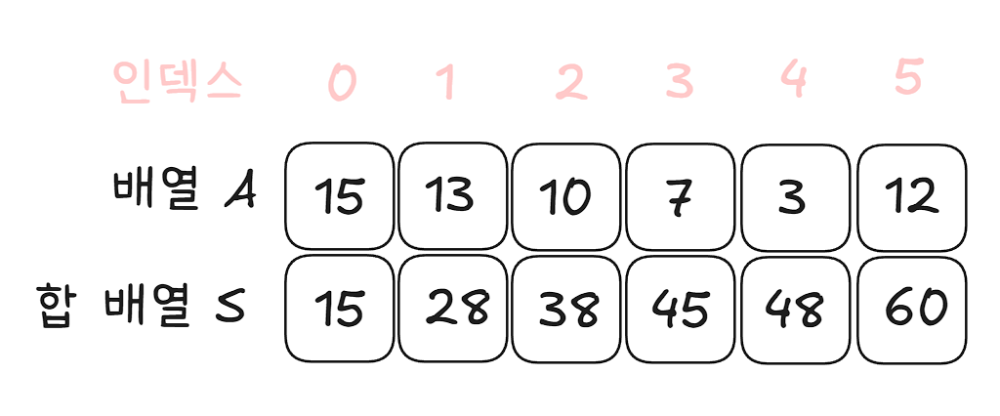

# 4-1 배열과 리스트, 벡터

## 배열과 리스트 이해하기

두 자료구조는 비슷한 점도 많지만 다른 점도 많다. 두 자료구조의 특징을 정확하게 이해하고 문제가 요구하는 조건에 따라 적절하게 선택해 사용하는 것이 중요하다.

### 배열

배열은 메모리의 연속 공간에 값이 채워져 있는 형태의 자료구조다.
배열의 값은 인덱스를 통해 참조할 수 있으며 선언한 자료형의 값만 저장할 수 있다.

**특징**

1. 인덱스를 사용하여 값에 바로 접근할 수 있다.
2. 새로운 값을 삽입하거나 특정 인덱스에 있는 값을 삭제하기 어렵다. 값을 삽입하거나 삭제하려면 해당 인덱스 주변에 있는 값을 이동시키는 과정이 필요하다.
3. 배열의 크기는 선언할 때 지정할 수 있으며, 한 번 선언하면 크기를 늘리거나 줄일 수 없다.
4. 구조가 간단하다.

### 리스트

리스트는 값과 포인터를 묶은 **노드**라는 것을 포인터로 연결한 자료구조다.

**특징**

1. 인덱스가 없으므로 값에 접근하려면 head 포인터부터 순서대로 접근해야 한다.
2. 따라서 값에 접근하는 속도가 비교적 느리다.
3. 포인터로 연결되어 있으므로 데이터를 삽입하거나 삭제하는 연산 속도가 빠르다. 맨 뒤에 포인터로 연결하거나 중간에 포인터 연결을 끊어주면 된다.
4. 선언할 때 크기를 별도로 지정하지 않아도 된다. 즉, 리스트의 크기는 정해져 있지 않으며 크기가 자주 변하는 데이터를 다룰 때 적절하다.
5. 포인터를 저장할 공간이 필요하므로 배열보다 구조가 복잡하다.

### 벡터

벡터는 C++ 표준 라이브러리에 있는 자료구조 컨테이너 중 하나로, 사용자가 손쉽게 사용할 수 있도록 정의된 클래스다.
기존의 **배열과 같은 특성을 가지면서도 배열의 단점을 보완**한, **동적 배열**의 형태라고 보면 된다.

**특징**

1. 동적으로 원소를 추가할 수 있다. 크기가 자동으로 늘어난다.
2. 맨 마지막 위치에 데이터를 삽입하거나 삭제할 때는 문제가 없지만 중간 데이터의 삽입 삭제는 배열과 같은 메커니즘으로 동작한다.
3. 배열과 마찬가지로 인덱스를 이용하여 각 데이터에 직접 접근할 수 있다.

## 벡터 사용법 익히기

### 1. 선언

```cpp
vector<int> A;
```

### 2. 삽입 연산

```cpp
A.push_back(1);               // 마지막에 1 추가
A.insert(A.begin(), 7);       // A.begin() 인덱스에 7 삽입
A.insert(A.begin() + 2, 10);  // A.begin() + 2 위치에 10 삽입
```

### 3. 값 변경

```cpp
A[4] = -5;
```

### 4. 삭제 연산

```cpp
A.pop_back();           // 마지막 값 삭제
A.erase(A.begin() + 3); // A.begin() + 3 위치의 값 삭제
A.clear();              // 모든 값 삭제
```

### 5. 값 가져오기

```cpp
A.size();   // 벡터 크기 = 원소 개수

A.front();  // 벡터의 첫 번째 원소 반환
A.back();   // 벡터의 마지막 원소 반환
A[3];       // 특정 인덱스에 해당하는 원소 반환
A.at(5);    // 특정 인덱스에 해당하는 원소 반환 (범위를 벗어나면 예외 발생시킴)

A.begin();  // 첫 번째 원소를 가리키는 반복자(iterator)
A.end();    // 마지막 원소를 가리키는 반복자(iterator)
```

**주의사항 몇가지**

1. `A.size()` 는 원소의 개수를 반환하므로, 마지막 원소에 접근하려면 `A[A.size() - 1]` 로 접근해야 한다. 단, 벡터가 비어있으면 안된다.
2. 벡터가 비어있지 않다는 가정 하에 `A.front() = 4;`, `A.back() = 100;` 같은 삽입연산도 가능하다.
3. A.begin(), A.end() 가 반환하는건 iterator다!
   - 활용 예시
     ```cpp
     for (auto it = A.begin(); it != A.end(); it++) {
       cout << *it << ' ';
     }
     ```

## 문제 풀이

### [문제 001] 숫자의 합 구하기

> 시간 제한 1초, 브론즈 5, [백준 11720번](https://www.acmicpc.net/problem/11720)
> 첫 번째 줄에 숫자의 개수 N (1<= N <= 100), 두 번째 줄에 숫자 N개가 공백 없이 주어진다. 이 숫자를 모두 합해 출력하는 프로그램을 작성하시오

N의 범위가 1부터 100이다. 그럼 두번째 줄에 최대 100자리 수가 주어질 수 있다는 뜻이므로, 두번째 숫자를 그냥 int 나 long으로 받을 수 없다.
따라서 N은 int 로 받고 숫자(numbers) 는 string 으로 받아야 한다.

**pseudo code**

```
N값 입력받기
숫자를 string으로 입력받기 (numbers)
sum 변수 선언

for(numbers 길이만큼 반복) {
    sum에 배열의 각 자리 값을 정수화 해서 더하기
}
sum 출력
```

[**풀이 코드**](https://www.acmicpc.net/submit/11720/104794414)

> C++ 에서의 형변환

string 형에서 숫자형으로 변환하기

```cpp
#include <string>

string sNum = "1234";
string sNum_d = "1234.56";

int inum = stoi(sNum);
long lnum = stol(sNum);
double dnum = stod(sNum_d);
float fnum = stof(sNum_d);
```

### [문제 002] 평균 구하기

> 시간 제한 2초, 브론즈 1, [백준 1546번](https://www.acmicpc.net/problem/1546)
>
> 문제
> 세준이는 기말고사를 망쳤다. 세준이는 점수를 조작해서 집에 가져가기로 했다. 일단 세준이는 자기 점수 중에 최댓값을 골랐다. 이 값을 M이라고 한다. 그리고 나서 모든 점수를 점수/M\*100으로 고쳤다.
> 예를 들어, 세준이의 최고점이 70이고, 수학점수가 50이었으면 수학점수는 50/70\*100이 되어 71.43점이 된다.
> 세준이의 성적을 위의 방법대로 새로 계산했을 때, 새로운 평균을 구하는 프로그램을 작성하시오.
>
> 입력
> 첫째 줄에 시험 본 과목의 개수 N이 주어진다. 이 값은 1000보다 작거나 같다. 둘째 줄에 세준이의 현재 성적이 주어진다. 이 값은 100보다 작거나 같은 음이 아닌 정수이고, 적어도 하나의 값은 0보다 크다.

여기서 하나 포인트!

점수를 변환해서 평균을 구하는건데, 변환하려면 최댓값을 알아내야 한다.
그런데 식을 잘 생각해보면,

> (A / M \* 100 + B / M \* 100 + C / M \* 100) / 3 = (A + B + C) \* 100 / M / 3

모든 점수에 M으로 나누고 100으로 한번 더 나누는걸 묶어서 보면 결국 전체 합에 대해 한번에 M으로 나누고 100으로 나눠도 된다!

**pseudo code**

```
N 입력받기
길이 N의 배열 선언하기 (scores)

for(scores 길이만큼 반복) {
  scores[i] 에 성적 저장하기
}

// 최대값 찾으면서 전체 합 구하기
max, sum, avg 변수 선언하기
for(scores 길이만큼 반복) {
  max 보다 크면 저장, 아니면 넘어감
  sum += scores[i];
}

avg = sum / max * 100 / 3;
```

[**풀이 코드**](https://github.com/LimSR12/Algorithm/commit/a0ff0bda080acaea957dd0c1f43bff385df897df)

# 4-2 구간 합

구간 합은 합 배열을 이용하여 시간 복잡도를 더 줄이기 위해 사용하는 특수한 목적의 알고리즘이다.

## 구간 합의 핵심 이론

구간 합 알고리즘을 활용하려면 먼저 합 배열을 구해야 한다.
배열 A가 있을 때 합 배열 S는 다음과 같이 정의할 수 있다.

### 합 배열 S 정의

> S[i] = A[0] + A[1] + A[2] + ... + A[i - 1] + A[i] // A[0]부터 A[i]까지의 합



합 배열은 위와 같이 기존 배열을 전처리해둔 배열이라고 생각하면 된다. 이렇게 합 배열을 미리 구해놓으면 기존 배열의 일정 범위 합을 구하는 시간 복잡도가 O(n) 에서 O(1)로 감소하게 된다.

A[i] 부터 A[j] 까지의 구간 합을 합 배열 없이 구할 경우, **최악의 경우는 i 가 0이고 j가 N인 경우**다. -> **`O(n)`**
그러나 **합배열을 사용하면 항상 `O(1)`**

### 합배열 S를 만드는 공식

> S[i] = S[i - 1] + A[i]

### 구간 합을 구하는 공식

> S[j] - S[i - 1]

## 문제 풀이

### [문제 003] 구간 합 구하기 1

> 시간 제한 0.5초, 난이도 실버 3, [백준 11659번](https://www.acmicpc.net/problem/11659)
> 수 N개가 주어졌을 때, i번째 수부터 j번째 수까지 합을 구하는 프로그램을 작성하시오.
>
> 입력
> 첫째 줄에 수의 개수 N과 합을 구해야 하는 횟수 M이 주어진다. 둘째 줄에는 N개의 수가 주어진다. 수는 1,000보다 작거나 같은 자연수이다. 셋째 줄부터 M개의 줄에는 합을 구해야 하는 구간 i와 j가 주어진다.
>
> 출력
> 총 M개의 줄에 입력으로 주어진 i번째 수부터 j번째 수까지 합을 출력한다.
>
> 제한
> 1 ≤ N ≤ 100,000
> 1 ≤ M ≤ 100,000
> 1 ≤ i ≤ j ≤ N

M번 반복하며 계산해야 하는데 제한시간이 0.5초다. 즉 5천만번의 연산 이내로 끊어내야 하는데 구간마다 매번 직접 반복하면 절대 안된다.

따라서 구간 합 배열을 만들어 사용하면 될 것 같다.

**pseudo code**

```
숫자 개수, 질문 개수 입력받기
S[N] 선언
for(인덱스 1부터 숫자 개수만큼 반복) {
  S[i] = S[i - 1] + 입력받은 수
}

// 계산하기
for(질문 개수만큼 반복) {
  start, end 입력받기

  cout << S[end] - S[start - 1] << "\n";
}
```

[**풀이 코드**](https://github.com/LimSR12/Algorithm/commit/5ba8e3a4cc40779f33cabb3fabadcf4b16b5f21b)

# 4-3 투 포인터

# 4-4 슬라이딩 윈도우

# 4-5 스택과 큐
