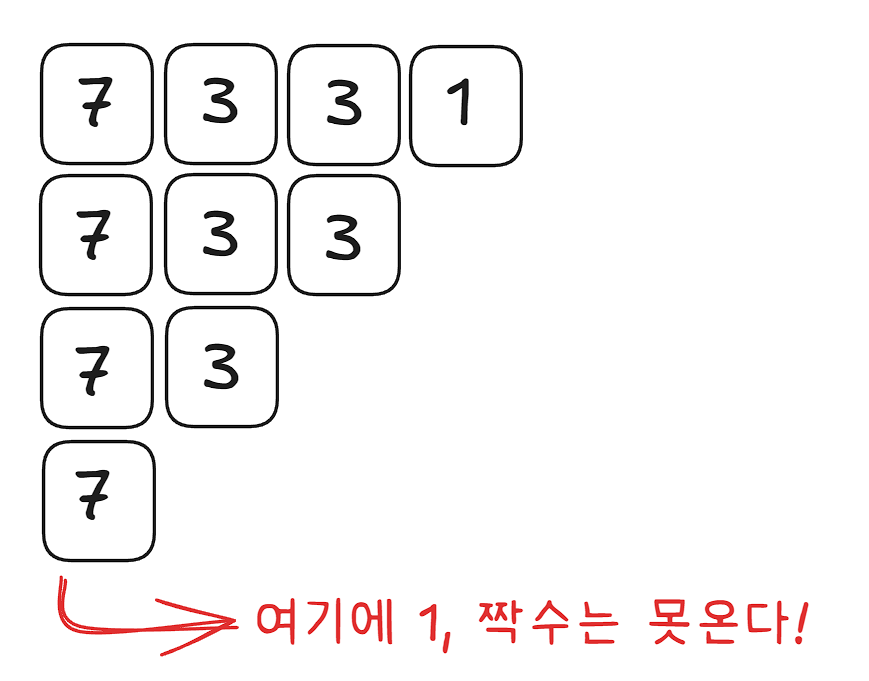
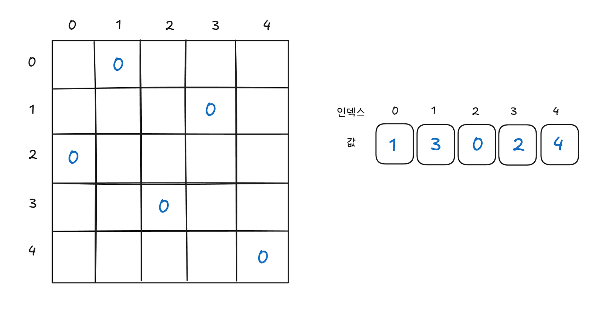
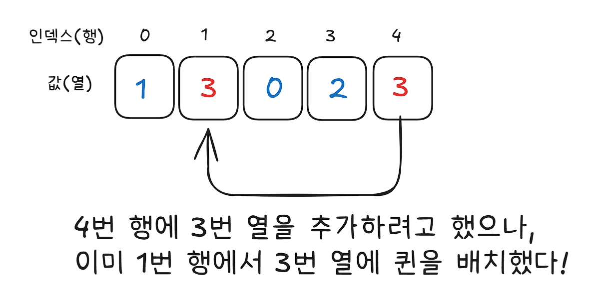
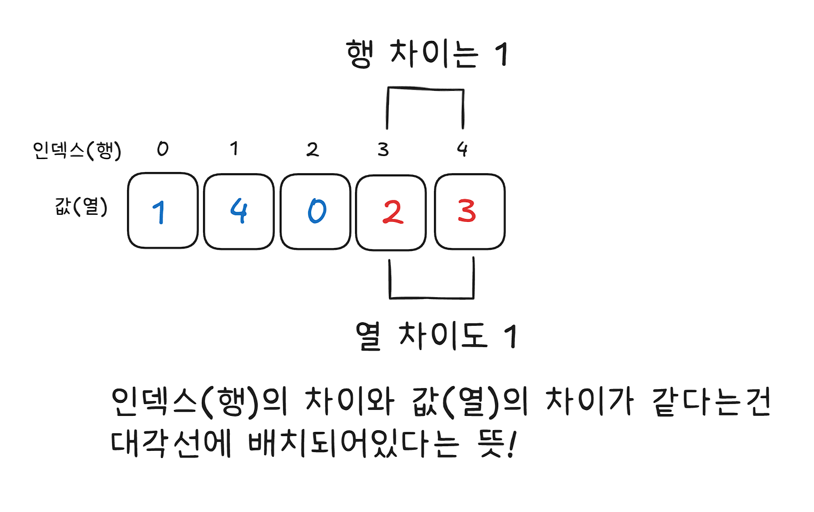
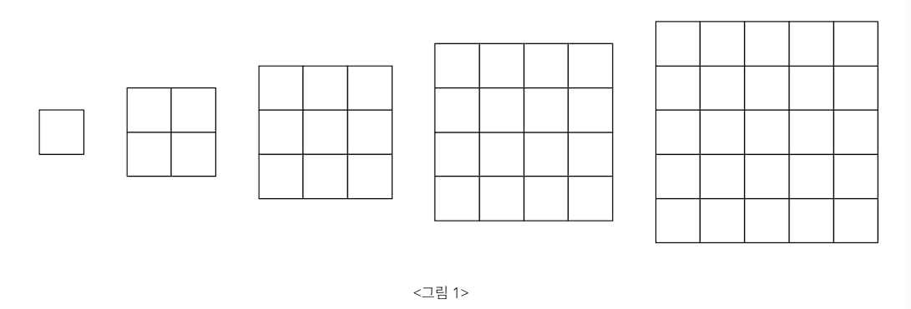

# 6-1 깊이 우선 탐색 DFS

> DFS란?
> 그래프나 트리에서 한 방향으로 끝까지 파고든 뒤, 더 이상 갈 곳이 없으면 되돌아와 다른 방향을 탐색하는 방법이다.

깊이 우선 탐색(이하 DFS)는 그래프 **완전 탐색 기법** 중 하나다.
그래프의 시작 노드에서 출발하여 탐색할 한쪽 분기를 정한 뒤 해당 분기의 최대 깊이까지 탐색을 마친 후 다른 쪽 분기로 이동하여 다시 탐색을 수행하는 알고리즘이다.

| 기능             | 특징                                          | 시간복잡도 (노드 수 V, 엣지 수 E) |
| ---------------- | --------------------------------------------- | --------------------------------- |
| 그래프 완전 탐색 | 재귀 함수로 구현<br />혹은 스택 자료구조 이용 | O(V + E)                          |

DFS를 응용하여 풀 수 있는 문제는 단절점 찾기, 단절선 찾기, 사이클 찾기, 위상 정렬 등이 있다.

## DFS 구현 방법 2가지

### 1. 재귀 방식

**예제 코드**

```cpp
vector<int> graph[1001];
bool visited[1001];

void dfs(int node) {
	visited[node] = true;
	cout << node << " ";

	for (int next : graph[node]) {
		if (!visited[next]) {
			dfs(next);
		}
	}
}

int main() {
	int n, m;
	cin >> n >> m;

	for (int i = 0; i < m; i++) {
		int a, b;
		cin >> a >> b;
		graph[a].push_back(b);
		graph[b].push_back(a); // 양방향 그래프라면 이렇게 추가!
	}

	dfs(1);
	return 0;
}
```

> 위 코드에서 graph 라는 배열은 무슨 의미를 가지는거지?

`vector<int> graph[1001]` 의 구조는 다음과 같다.

```
graph[1001] 의 실제 구조:

graph[0] → [ ]
graph[1] → [ 2, 3, 4 ]   ← 1번 노드의 인접 노드 목록
graph[2] → [ 1 ]
graph[3] → [ 1 ]
graph[4] → [ 1 ]
```

즉, **`vector<int>` 라는 객체가 1001개 들어있는 배열**이고, `graph[i]`에는 `i` 라는 정점에서 연결되는 정점들이 저장된다.
각 정점마다 연결된 정점을 벡터에 저장하기 위함이다!

> 혹은 동적으로 이중 벡터 사용해도 된다!

`vector<int> graph[1001]` 는 정적 배열을 vector 에 담는거라, 컴파일 타임에 공간이 고정된다.
따라서 사용하든 안하든 1001 칸이 무조건 확보되는데, 메모리를 아끼기 위해 동적으로 이중 벡터를 사용하는 것도 방법이다.

`vector<vector<int>> graph` 와 같이 선언하면 처음엔 크기 0으로 할당되고, 그래프의 크기를 입력받아 `resize()` 해줘야 한다!

```cpp
// 노드 수 최댓값을 알 때 -> 그냥 배열로 고정!
// 간단하고 실수가 없어서 좋다
vector<int> graph[1001];

// 노드 수가 입력으로 주어질 때 -> 동적으로
int n, m;
cin >> n >> m;
vector<vector<int>> graph(n + 1); // n+1 칸 초기화

for (int i = 0; i < m; i++) {
    int a, b;
    cin >> a >> b;
    graph[a].push_back(b);
    graph[b].push_back(a);
}
```

> 그럼 여기서 가중치 그래프가 나온다면?

`vector<int>` 가 아니라 `vector<pair<int, int>>` 로 선언하면 된다!

```cpp
graph[1].push_back({2, 5});  // 1 -> 2, 가중치 5
graph[1].push_back({3, 7});  // 1 -> 3, 가중치 7
```

그리고 순회할때는, 위 예제에서는 for 문 안에 `int next: graph[node]` 로 돌렸던 것과 비슷하게 이번에는 `pair<int, int> edge: graph[node]` 로 돌릴 수 있다.
이때 돌면서 edge 에 들어있는 edge.first 와 edge.second 를 다음과 같이 분해해줘야 한다.

```cpp
for (pair<int, int> edge : graph[node]) {
    int next = edge.first;
    int cost = edge.second;
}
```

아니면 auto 를 써서 `auto edge: graph[node]` 를 써도 된다.

```cpp
for (auto edge : graph[node]) {
    int next = edge.first;
    int cost = edge.second;
}
```

그런데! C++17 이후부터는 바로 구조 분해 할당도 가능하다.

```cpp
for (auto [next, cost] : graph[node]) {
    // next: 다음 정점
    // cost: 가중치
}
```

혹은 pair가 아니라 struct 가 들어있는 경우도 있을 텐데, 이때는 구조 분해 할당은 안되고 직접 할당해주면 된다.

```cpp
// 구조체로 엣지 정의
struct Edge {
    int to;
    int cost;
};

vector<Edge> graph[1001];

// 순회할때는 다음과 같이!
for (auto edge : graph[node]) {
    int next = edge.to;
    int cost = edge.cost;
}
```

### 2. 스택 방식

**예제 코드**

```cpp
void dfs_stack(int start, vector<int> graph[], bool visited[]) {
    stack<int> st;
    st.push(start);

    while (!st.empty()) {
        int node = st.top();
        st.pop();

        if (visited[node]) continue;
        visited[node] = true;
        cout << node << " ";

        // 재귀와 순서 맞추려면 역순으로 push
        for (int i = graph[node].size() - 1; i >= 0; i--) {
            if (!visited[graph[node][i]]) {
                st.push(graph[node][i]);
            }
        }
    }
}
```

## DFS 에서 인접 리스트 vs 인접 행렬

|                 | 인접 리스트 `vector<int> graph[]` | 인접 `int graph[][]`                    |
| --------------- | --------------------------------- | --------------------------------------- |
| 구조            | 각 노드마다 연결된 노드 목록 저장 | 2차원 배열, `[i][j] = 1` 이면 연결된 것 |
| 공간            | O(V + E)                          | O(V^2)                                  |
| 노드 수 많을 때 | 효율적                            | 메모리 낭비                             |
| 코테 사용 빈도  | 주로 사용!                        | 노드 수 적을땐 이게 나을수도?           |

## DFS 시간/공간복잡도

| 구분 | 복잡도                       |
| ---- | ---------------------------- |
| 시간 | O(V + E) -> V: 정점, E: 간선 |
| 공간 | O(V) -> 재귀 스택 깊이       |

## DFS를 선택하는 기준 (BFS와 비교)

| 상황                   | DFS | BFS |
| ---------------------- | --- | --- |
| 경로가 존재하는지 여부 | ✅  | ✅  |
| 최단 경로              | ❌  | ✅  |
| 모든 경우의 수 탐색    | ✅  | ❌  |
| 연결 요소 개수         | ✅  | ✅  |
| 백트래킹과 연계        | ✅  | ❌  |

## 연습문제

### [문제 023] 연결 요소의 개수 구하기

> 시간 제한 3초, 실버2, [백준 11724번](https://www.acmicpc.net/problem/11724)
>
> 방향 없는 그래프가 주어졌을 때 연결 요소의 개수를 구하는 프로그램을 작성하시오.

[문제 풀이 결과](https://github.com/LimSR12/Algorithm/commit/b0a8851dde27dabdc2b32e3582c153cc555ac6ee)

### [문제 024] 신기한 소수 찾기

> 시간 제한 2초, 골드 5, [백준 2023번](https://www.acmicpc.net/problem/2023)
>
> 7331은 소수인데, 신기하게도 733도 소수이고, 73도 소수이고, 7도 소수이다. 즉, 왼쪽부터 1자리, 2자리, 3자리, 4자리 수 모두 소수이다! 수빈이는 이런 숫자를 신기한 소수라고 이름 붙였다.
> 수빈이는 N자리의 숫자 중에서 어떤 수들이 신기한 소수인지 궁금해졌다. N이 주어졌을 때, 수빈이를 위해 N자리 신기한 소수를 모두 찾아보자.

처음 문제를 봤을 때는 이걸 도대체 어떻게 풀라는건가? 싶었는데, 책의 '손으로 풀어보기' 내용을 읽어보며 감을 잡을 수 있었다.

핵심은 이거다. N자리 수의 가장 왼쪽 수 하나만 남았을 때 얘도 소수여야 한다!



따라서 최후의 한 자리 숫자로 올 수 있는건 한 자리 소수인 2, 3, 5, 7이 유일하고, 이걸 시작점으로 가지치기 해나가면 되는거였다.

**의사 코드**

```
N 입력
DFS 실행(2, 3, 5, 7 로 탐색 시작)

DFS(숫자, 현재 자릿수) {
  if(현재 자릿수 == N) {
    if(숫자가 소수라면) 숫자 출력
    탐색 종료
  }

  for(1부터 9까지) {
    if(뒤에 붙는 수가 홀수이면서 소수인 경우) {
      DFS(수*10 + 뒤에 붙는 수, 현재 자릿수 + 1)
    }
  }
}
```

[문제 풀이 결과](https://github.com/LimSR12/Algorithm/commit/fa42ed990e05e368adde5b25a28807a558691a14)

### [문제 025] 친구 관계 파악하기

> 제한 시간 2초, 골드 5, [백준 13023번](https://www.acmicpc.net/problem/13023)
>
> BOJ 알고리즘 캠프에는 총 N명이 참가하고 있다. 사람들은 0번부터 N-1번으로 번호가 매겨져 있고, 일부 사람들은 친구이다.
>
> 오늘은 다음과 같은 친구 관계를 가진 사람 A, B, C, D, E가 존재하는지 구해보려고 한다.
>
> - A는 B와 친구다.
> - B는 C와 친구다.
> - C는 D와 친구다.
> - D는 E와 친구다.
>
> 위와 같은 친구 관계가 존재하는지 안하는지 구하는 프로그램을 작성하시오.

# 6-2 백트래킹 (Backtracking)

## 백트래킹이란?

> DFS로 탐색하되, 가망 없는 경로는 일찍 포기하고 되돌아오는 풀이 기법이다!

일반적으로 재귀 함수 형태로 구현하며, DFS 의 개념과 구현 방식이 매우 유사하다. 가장 큰 특징으로는 유효하지 않는 경로는 조기에 배제하여 탐색 범위를 줄이고 성능을 높일 수 있다는 것이다!

**Pruning, 가지치기** 라고도 하는 것 같다. `"이 경로를 계속 탐색할 가치가 있는가?"` 를 매 단계에서 판단한다!

아래는 클로드가 알려준 백트래킹 기본 템플릿과 체크리스트다.

```cpp
void backtrack(현재상태) {
    // ① 종료 조건 (정답 발견)
    if (목표 도달) {
        정답 처리();
        return;
    }

    // ② 선택 가능한 후보들 순회
    for (각 후보 : 후보목록) {

        // ③ 가지치기 — 유망하지 않으면 스킵
        if (유망하지 않음) continue;

        // ④ 선택
        상태 변경(후보 선택);

        // ⑤ 재귀 탐색
        backtrack(다음 상태);

        // ⑥ 선택 취소 ← 백트래킹의 핵심!
        상태 복원(후보 취소);
    }
}
```

종료 조건을 따로 명시해 early return 하는 것을 볼 수 있고, 이후 for 문에서도 필요 없는 경로는 스킵해버리며 탐색 범위를 줄여주는 것을 확인할 수 있다.

```
✅ 선택 → 재귀 → 취소 (복원) 3단계 구조 숙지
✅ 가지치기 조건이 빠를수록 성능이 좋아짐
✅ used[] 배열 또는 visited[][] 로 상태 관리
✅ 전역 변수로 최솟값/최댓값 추적하는 패턴 익히기
✅ N-Queen, 순열/조합 유형은 손으로 직접 구현 연습
```

## 문제 풀이

### [문제 026] N과 M

> 제한 시간 1초, 실버 3, [백준 15649번](https://www.acmicpc.net/problem/15649)
>
> 자연수 N과 M이 주어졌을 때, 아래 조건을 만족하는 길이가 M인 수열을 모두 구하는 프로그램을 작성하시오.
>
> - 1부터 N까지 자연수 중에서 중복 없이 M개를 고른 수열
> - (1 ≤ M ≤ N ≤ 8)

길이가 M인 수열을 구하는데, 앞에서 나온건 뒤에 다시 못나오니까 중복 버려가면서 탐색하면 된다!

**의사 코드**

```
N, M 입력
V (숫자 사용 여부 저장할 배열)
S (현재까지 만들어진 수열 저장할 배열)

backtracking(수열 길이) {
  if(수열 길이가 M) {
    S에 들어있는 수열 출력
    리턴
  }
  for(1부터 N까지) {
    if(아직 S에 포함되지 않은 수인 경우) {
      V 에 사용한걸로 변경
      S 에 추가
      backtraking(수열 길이 + 1)
      V 에 사용한 표시 제거
    }
  }
}
```

[문제 풀이 결과](https://github.com/LimSR12/Algorithm/commit/9801c385c2f2d8a838ef46c18022862c850d831b)

### [문제 027] N-Queen 배치하기

> 시간 제한 10초, 골드 4, [백준 9663번](https://www.acmicpc.net/problem/9663)
>
> N-Queen 문제는 크기가 N × N인 체스판 위에 퀸 N개를 서로 공격할 수 없게 놓는 문제이다.
> N이 주어졌을 때, 퀸을 놓는 방법의 수를 구하는 프로그램을 작성하시오.
>
> (1 ≤ N < 15)

퀸은 상하/좌우/대각선으로 이동 가능하다. 퀸이 서로 공격할 수 없도록 하려면 일단 1개의 열, 1개의 행에는 퀸이 1개만 있을 수 있다.

따라서 첫 줄에 `N`개 중 하나를 정해 퀸을 놓으면, 다음 줄에는 해당 위치의 왼쪽 대각선/아래/오른쪽 대각선의 3칸 제외하고 나머지 `N-3`개 중 하나를 골라 놓을 수 있다.
즉, 안되는 칸은 탐색 종료해버리고 되는 칸만 계속 탐색을 이어나가며, 최종적으로 모두 뒀으면 이제 카운트 1 증가!

이때 퀸의 위치 정보를 2차원 배열에 저장하면 로직이 너무 복잡해진다.
아래와 같이 배열을 하나 사용하는데, 배열의 인덱스를 행(row), 해당 인덱스의 값을 열(row)로 사용하면 일차원 배열로도 퀸의 위치를 저장할 수 있다.



그래서 인덱스를 늘려가면서 for 문을 돌릴거니까 row를 늘려간다는 의미고, 그럼 다음 row 에 퀸을 어디 놓을 수 있는지 체크할 함수도 하나 필요하다.

이때 같은 열에 넣을 수 있는지, 대각선으로 넣을 수 있는지 체크해야 한다.





[문제 풀이 결과](https://github.com/LimSR12/Algorithm/commit/141119e847448dcd0b6c8b21be31bf46f70f9c95)

### [문제 028] 색종이 붙이기

> 시간 제한 1초, 골드 2, [백준 17136번](https://www.acmicpc.net/problem/17136)
>
> 그림1 과 같이 정사각형 모양을 한 다섯 종류의 색종이가 있다. 색종이의 크기는 1×1, 2×2, 3×3, 4×4, 5×5로 총 다섯 종류가 있으며, 각 종류의 색종이는 5개씩 가지고 있다.
> 
> 색종이를 크기가 10×10인 종이 위에 붙이려고 한다. 종이는 1×1 크기의 칸으로 나누어져 있으며, 각각의 칸에는 0 또는 1이 적혀 있다. 1이 적힌 칸은 모두 색종이로 덮여져야 한다. 색종이를 붙일 때는 종이의 경계 밖으로 나가서는 안되고, 겹쳐도 안 된다. 또, 칸의 경계와 일치하게 붙여야 한다. 0이 적힌 칸에는 색종이가 있으면 안 된다.
>
> 종이가 주어졌을 때, 1이 적힌 모든 칸을 붙이는데 필요한 색종이의 최소 개수를 구해보자.
>
> **출력**
> 모든 1을 덮는데 필요한 색종이의 최소 개수를 출력한다. 1을 모두 덮는 것이 불가능한 경우에는 -1을 출력한다.

색종이는 5종류 각각 5장씩, 총 25장 가지고 있다. 개수가 많지 않아서 모든 경우의 수를 탐색해봐도 되겠다.
그리고 이때 모든 경우의 수는 백트래킹 알고리즘으로 구하면 된다!

그리고 색종이로 덮는 건 1 -> 0으로 나타내어 표현하자!

**1. 가능한 선택지 탐색**

탐색은 색종이를 붙일 수 있는 첫번째 위치를 찾는걸로 시작하고, 탐색 방향은 왼쪽 위에서 시작하여 오른쪽으로 이동하고 오른쪽 끝에 도달하면 한줄 내려가 반복한다.

**2. 유효성 검사 및 가지치기**

선택한 위치에 색종이를 붙일 수 있는지 확인한다. 사용할 수 있는 색종이의 크기는 다섯 종류이고, 각각 최대 5장 쓸 수 있다.

색종이를 해당 위치에 붙일 수 있다면 탐색을 계속 진행하고, 붙일 수 없다면 해당 탐색을 종료한다. 또한 색종이 개수를 최소화하는 것이 목표이므로 현재까지 사용한 색종이 수가 이미 구한 색종이의 개수를 초과하는 경우에도 탐색을 중단한다.

**3. 정답 도출**

모든 탐색을 완료하면 해당 과정에서 사용한 색종이 수를 기록한다.

# 6-3 너비 우선 탐색 BFS

> BFS란?
> 너비 우선 탐색 역시 그래프를 완전 탐색하는 방법 중 하나로, 시작 노드에서 출발해 가까운 노드부터 차례대로 탐색하는 알고리즘이다.

BFS는 자료구조로 큐를 주로 사용하고, 가까운 노드부터 방문하기 때문에 최단 경로를 보장한다. 또한 DFS는 경로의 길이만큼 메모리를 사용하는 것에 비해 BFS는 같은 레벨의 노드 수만큼 메모리를 사용하게 된다!

```
그래프:
        1
       / \
      2   3
     / \   \
    4   5   6

DFS 탐색 순서: 1 → 2 → 4 → 5 → 3 → 6  (깊이 우선)
BFS 탐색 순서: 1 → 2 → 3 → 4 → 5 → 6  (거리 순)
```

> 그럼 BFS는 언제 사용하면 좋은가요?

**1. 가까운 것부터 찾고 싶을 때**

- 시작점에서 가장 먼저 도달할 수 있는 노드
- 최소 이동 횟수
- 최단 거리

**2. 가중치가 없는 그래프에서 최단 거리를 구할 때**

- 한 번 이동할 때마다 비용이 똑같다
- 미로에서 상하좌우 한 칸 이동
- 정점 간 간선의 비용이 전부 1이다

이런 경우 가장 먼저 도착한 경로가 최단 경로가 된다!

**3. 레벨 단위로 탐색할 때**

- 시작점으로부터 거리 1인 노드들
- 거리 2인 노드들
- 거리 3인 노드들

이런 식으로 층층이 퍼져나가는 문제랑 잘 맞는다.

> 그럼 왜 큐를 쓰나요?

일단! 인접 리스트를 사용해 그래프를 나타내는 건 DFS와 동일하다.

다만 탐색 과정에서 재귀 함수가 아닌 큐를 사용하는 이유는, BFS는 먼저 들어온 정점을 먼저 처리해야 하기 때문이다.
큐는 **FIFO(First In First Out)** 구조다. 따라서 먼저 들어온 것이 먼저 나가기 때문에 이러한 구조가 BFS와 완전히 맞아떨어진다!

실제로 탐색하는 과정은 다음과 같다.
예를 들어 다음과 같은 그래프가 인접리스트에 저장되어 있다.

```
        1
       / \
      2   3
     / \   \
    4   5   6
1과 연결: 2, 3
2와 연결: 4, 5
3과 연결: 6
```

처음에 1을 큐에 넣는다.

```
queue = [1]
```

1을 꺼내서 인접리스트를 보면 2, 3이 발견되고, 2, 3을 큐에 넣는다

```
queue = [2, 3]
```

이제 2를 꺼내서 인접리스트를 보면 4, 5가 발견되고, 4, 5를 큐에 넣는다.

```
queue = [3, 4, 5]
```

그다음 3을 꺼내서 인접리스트를 보면 6이 발견되고, 6을 큐에 넣는다.

```
queue = [4, 5, 6]
```

이후 4, 5, 6을 꺼낼때는 인접리스트를 봐도 인접 노드가 없기 때문에 꺼내고 큐가 비면 종료된다.

```
탐색 순서: 1 → 2 → 3 → 4 → 5 → 6
```

## BFS 구현 방법

그래프가 다음과 같이 있다고 가정하면,

```cpp
vector<int> graph[1001];
bool visited[1001];
```

보통 BFS는 이렇게 구현한다.

```cpp
#include <iostream>
#include <vector>
#include <queue>

using namespace std;

vector<int> graph[1001];
bool visited[1001];

void bfs(int start) {
    queue<int> q;

    q.push(start);
    visited[start] = true;

    while (!q.empty()) {
        int now = q.front();
        q.pop();

        cout << now << " ";

        for (int next : graph[now]) {
            if (!visited[next]) {
                visited[next] = true;
                q.push(next);
            }
        }
    }
}
```

> 이때 `visited` 처리 타이밍이 중요하다!
> 큐에서 꺼낼 때가 아니라, 큐에 넣을 때 visited를 true로 해야 한다.
> 꺼낼 때 처리하면 같은 노드가 큐에 중복으로 들어갈 수 있다!

예를 들어 4번 노드가 2를 통해서도 발견될 수 있고, 3을 통해서도 발견될 수 있다.
그런데 큐에서 꺼낼 때 방문 처리하면 2도 4를 넣고, 3도 4를 넣는 일이 생길 수 있다.

그래서 BFS는 보통 발견 즉시 방문 처리를 해야 한다.

# 6-4 이진 탐색 (Binary Search)

> 이진 탐색이란?
> 데이터가 정렬된 상태에서 원하는 값을 찾아내는 알고리즘으로, 탐색 범위의 중앙값과 찾고자 하는 값을 비교해 범위를 절반씩 줄이면서 대상을 찾는 알고리즘이다.

구현 및 원리가 비교적 간단해서, 많은 코테에서 부분문제로 요구하는 경우도 많다고 한다.

## 이진 탐색 과정

1. 현재 데이터셋의 중앙값을 선택한다.
2. 중앙값 > 타겟값일 때 중앙값 기준으로 왼쪽 데이터셋을 선택한다.
3. 중앙값 < 타겟값일 때 중앙값 기준으로 오른쪽 데이터셋을 선택한다.
4. 1~3을 반복하다가 중앙값 == 타겟값일 때 탐색을 종료한다.

절반씩 줄여나가기 때문에, `N개`의 데이터에서 최대 `logN번`의 연산으로 원하는 데이터의 위치를 찾아낼 수 있다!

## 문제 풀이

### [문제 032] 원하는 정수 찾기

> 시간 제한 2초, 실버 5, [백준 1920번](https://www.acmicpc.net/problem/1920)
>
> N개의 정수 A[1], A[2], …, A[N]이 주어져 있을 때, 이 안에 X라는 정수가 존재하는지 알아내는 프로그램을 작성하시오.
> N(1 ≤ N ≤ 100,000)

N의 최대 범위가 10만이라 O(n^2) 의 단순 반복문으로는 시간 초과로 문제를 풀 수 없다.
이진 탐색을 적용하면 데이터 정렬까지 고려해도 O(nlogn) 정도의 시간 복잡도로 해결 가능하다!

**[참고] std::sort() 의 시간복잡도**

C++ 표준 라이브러리에서 제공하는 `sort()`는 Introsort 기반으로 구현되어있다고 한다. 평소에는 퀵정렬처럼 빠르게 동작하다가, 재귀 깊이가 너무 깊어져서 퀵 정렬 worst 케이스가 위험해지면 힙 정렬로 전환한다고 한다. 또한 구간이 아주 작아지면 삽입정렬도 사용하기도 한다고 한다.

어쨋든 `sort()`의 시간 복잡도는 `O(N log N)`라고 생각하고 사용해도 된다고 함!

**중앙값 찾기**

```cpp
mid = (left + right) / 2;
```

혹은 오버플로우까지 고려하면

```cpp
mid = left + (right - left) / 2;
```

[문제 풀이 결과](https://github.com/LimSR12/Algorithm/commit/162ab4d84c1a1a022384fd03ceac36c990f0ec58)
