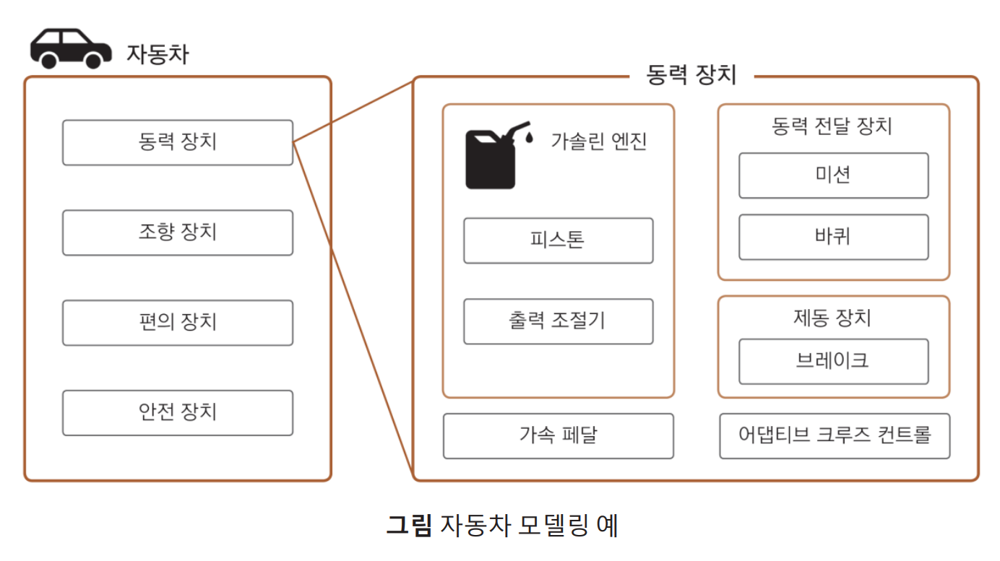
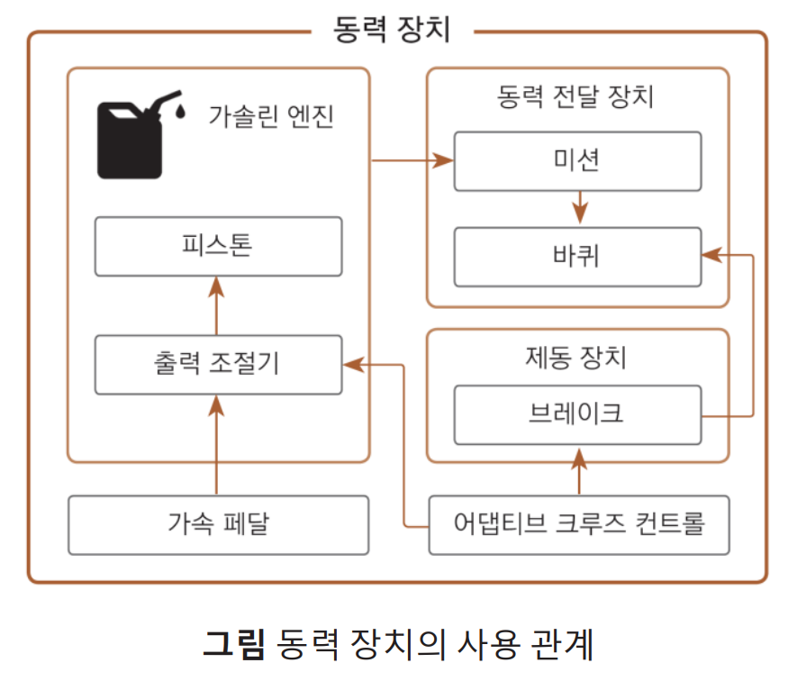
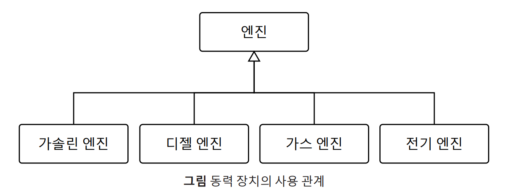
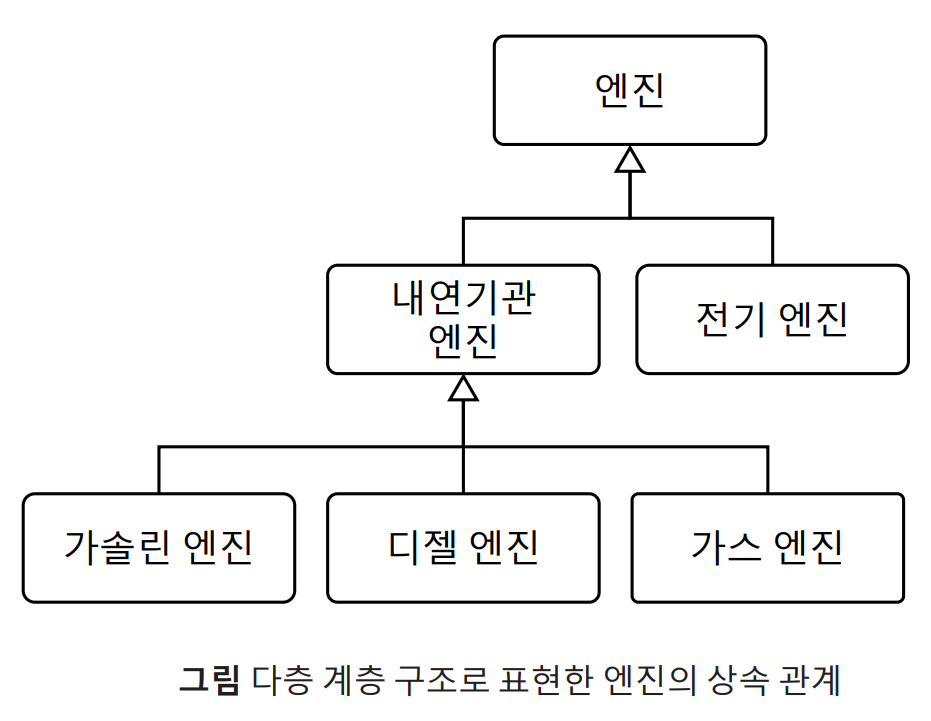

# 6-1 객체지향 이전의 프로그래밍 패러다임

## 프로그래밍 패러다임

프로그래밍 패러다임이란?

> 프로그램을 어떤 절차와 구조로 만들 것인지에 대한 스타일이나 접근 방법이다!

패러다임은 언어가 지원하는 기능, 코드의 구조, 문제 해결 접근 방식등에 따라 다르다.
흔히 알려진 패러다임의 종류는 비구조적 패러다임, 절차지향 프로그래밍, 객체지향 프로그래밍 등이 있다.

## 비구조적 프로그래밍

코드를 구조화하지 않고 작성하는 방법이다. 첫번째 줄부터 마지막 줄까지 쭉 차례대로 실행하는 다소 원시적인 형태다.
어셈블리어, 초창기 포트란 같은 언어에서 비구조적 프로그래밍을 많이 찾아볼 수 있었다!

## 절차지향 프로그래밍

소스 코드를 여러 부분으로 나눠서 활용하고, 프로시저를 이용해 구조화하는 방식이다.
여기서 프로시저란 일련의 코드 묶음을 말하고, 보통 함수를 프로시저라고 부른다!

C언어, 코볼, 포트란 등의 언어에서 많이 나타나는 형태였다.
코드를 논리구조로 모듈화해서 동일 코드를 재작성할 필요 없도록 하고, 재사용을 위해 기능을 묶어 라이브러리 모듈로 제공하는 것이 특징이다!

### 절차적 프로그래밍 예제

객체 지향 프로그래밍은 스프링을 통해 익숙하게 많이 접해왔는데 절차 지향 프로그래밍은 크게 와닿지 않는 것 같다. 그래서 AI에게 동일 기능을 하는 절차/객체 지향 두 코드를 작성해달라고 했고, 확실히 이걸 보니 이해가 되는 것 같다.

#### C 절차 지향 버전

```c
// 데이터는 그냥 구조체나 변수
typedef struct {
    char name[50];
    int age;
    double balance;
} Account;

// 함수들이 데이터를 외부에서 받아서 처리
void deposit(Account *account, double amount) {
    account->balance += amount;
}

void withdraw(Account *account, double amount) {
    if (account->balance >= amount) {
        account->balance -= amount;
    }
}

void printInfo(Account *account) {
    printf("이름: %s, 잔액: %.2f\n", account->name, account->balance);
}

// main()이 모든 흐름을 직접 제어
int main() {
    Account acc = {"홍길동", 30, 0.0};

    deposit(&acc, 10000);
    withdraw(&acc, 3000);
    printInfo(&acc);   // <- 이 순서(절차)가 곧 프로그램

    return 0;
}
```

절차지향의 핵심 사고방식은 다음과 같다고 한다.

> 프로그램 = 순서대로 실행되는 절차(프로시저 = 함수)들의 나열

즉 데이터와 함수는 분리되어있고, 함수는 외부로부터 데이터를 받아서 사용하는 구조가 절차지향이다!

#### Java 객체 지향

```java
// 데이터 + 행동이 하나의 객체 안에 묶임
public class Account {
    private String name;
    private int age;
    private double balance;

    public Account(String name, int age) {
        this.name = name;
        this.age = age;
        this.balance = 0.0;
    }

    // 데이터를 다루는 행동이 객체 안에 있음
    public void deposit(double amount) {
        this.balance += amount;
    }

    public void withdraw(double amount) {
        if (this.balance >= amount) {
            this.balance -= amount;
        }
    }

    public void printInfo() {
        System.out.printf("이름: %s, 잔액: %.2f%n", name, balance);
    }
}

// main은 객체에게 메시지를 보낼 뿐
public class Main {
    public static void main(String[] args) {
        Account acc = new Account("홍길동", 30);

        acc.deposit(10000);   // "야 acc야, 입금해"
        acc.withdraw(3000);   // "야 acc야, 출금해"
        acc.printInfo();
    }
}
```

위와 같이 클래스 안에 데이터를 관리할 필드와 로직을 처리할 메서드를 두고, 각 객체가 자신의 책임, 역할, 상태를 가지는게 객체지향 프로그래밍의 구조다!

### 절차적 프로그래밍의 장점

1. 실행 흐름이 직관적이다.
   객체 지향은 호출 하나가 내부적으로 어떤 객체를 거치는지 추적하려면 여러 클래스를 넘나들어야 하지만, 절차지향은 실행 순서 = 코드 읽는 순서라 흐름 파악이 쉽다.
2. 성능 상 유리하다.
   OOP는 객체 생성, 가상 함수 테이블(vtable), 동적 디스패치 등의 오버헤드가 있다. 반면 절차지향은 함수 호출이 단순한 점프라 실행 속도가 빠르다.
   그래서 OS 커널, 임베디드 시스템, 게임 엔진 내부 성능 크리티컬한 부분은 지금도 C로 작성하는 이유다.
3. 작은 규모에서 단순한 구조로 구현 가능하다.
   클래스 설계, 의존성 주입 같은 걸 고민하는 비용 자체가 낭비일 만큼 작은 규모에서는 절차지향이 좋을 수 있다.
4. 하드웨어와 가까워 저수준 제어에 유리하다.
   메모리를 직접 다루거나, 레지스터 수준의 제어가 필요할 때 절차지향이 압도적으로 유리하다. OOP의 추상화 레이어가 오히려 방해가 될 수 있다.

단! 잘 구조적으로 프로시저를 분배하고 설계했을 때의 장점이다.

### 절차적 프로그래밍의 단점

1. 프로시저 간에 논리적 계층 구조가 존재한다고 하더라도 모든 코드를 확인하기 전에는 알기 어렵다. (논리 구조가 복잡할 경우 프로시저 계층 구조 파악이 어렵기도 하다.)
2. 전역 변수를 선언하고 사용할 경우, 어느 프로시저에서 변경하는지 관리하기 어렵다.
3. 전역 함수를 사용하면 소스코드의 모든 곳에서 해당 프로시저에 접근할 수 있고, 접근을 제어하기 어렵거나 불필요한 정보 노출 및 접근이 발생할 수 있다.

# 6-2 객체지향 프로그래밍

## 객체지향 프로그래밍 (이하 OOP)

### OOP의 개념

> 객체지향 프로그래밍은 데이터와 함수를 포함하는 객체를 활용하는 프로그래밍 패러다임이다.
> 다양한 객체 간의 관계를 소스코드로 구성하여 프로그램을 완성한다.

### OOP의 필요성

절차지향 프로그래밍이라는 이전 패러다임의 한계를 극복하기 위함이었다고 한다.
그리고 이를 위해 다음과 같은 특징을 가진다고 한다.

- 논리적 계층 관계 표현
  - 복잡하고 다양한 객체 간의 계층 관계를 표현할 수 있어야 한다.
- 현실 모델링
  - 현실 세계의 사물이 가진 특징과 관계를 표현할 수 있어야 한다.
- 접근 제어
  - 불필요한 정보 노출과 접근을 효과적으로 제어할 수 있어야 한다.

조금 더 자세히 정리해보자!

#### 객체를 사용해 현실 세계 모델링

> 추상화

결국 프로그램은 현실 세계의 이슈를 코드로 해결하는 것이고, 이를 위해 현실 세계의 도메인을 모델링할 수 있어야 한다!

이를 위해 **추상화**라는 개념이 필요한데, 현실 세계의 대상을 논리적으로 구조화하기 위해 단순화/일반화 하는 과정을 말한다.

자동차 안에는 동력장치/조향장치/편의장치/안전장치 의 4가지 도메인이 있고, 그 안에는 각각 세부 하위 도메인이 있을 것이다.

그리고 아래 그림은 자동차 및 동력장치를 추상화하여 모델링한 결과다!



> 객체 간 사용관계

이제 현실세계의 관계를 추상화해 객체로 만들었다면, 이제 객체 간의 사용 관계 역시 정의해야 한다.

1. 객체의 역할, 포함 관계 -> 객체 간의 정적인 관계, 순간적인 구조
2. 사용 관계 -> 객체 간의 동적인 관계, 객체 간 종속성을 알려주는 관계



#### 객체 간의 논리적 계층 관계 표현

현실 도메인을 객체화했다면 이제 객체 간의 관계를 나타낼 수 있어야 한다!

> 대표 객체와 파생 객체

여러 객체가 있으면, 여러 객체에 **공통적으로 포함된 역할이나 기능**이 있을 수 있다. 그런데 이걸 모든 객체마다 각각 정의하는 것은 효율적이지 않으므로, **대표 객체**를 두고 **대표 객체를 상속받는 파생 객체**를 둔다!



> 여러 객체의 중첩 표현

추상화를 여러 계층으로 진행하여 복잡한 논리 구조를 표현한다.
위 예시에서 동력 장치를 예시로 들면 다음 그림과 같이 `엔진` 하위에 `내연기관 엔진`과 `전기 엔진`으로 분류하고, 또 `내연 기관 엔진` 하위에 `가솔린 엔진`과 `디젤 엔진`, `가스 엔진` 등으로 분류해 표현할 수 있다.

즉, 하위의 객체는 상위 객체를 상속받아 구현하고, 계층화할 수 있다



#### 객체 간의 접근 제어

> 객체 내부를 외부에서 함부로 건드리지 못하게 한다

각 객체의 내부 필드를 외부에서 아무렇게나 막 건드릴 수 있으면 안된다. 만약 `'계좌'`라는 객체 안에 `'잔액'` 이라는 필드가 있는데 외부에서 막 건드려버린다면? 잔액을 `-999999` 로 바꾸려고 시도할수도 있을 것이다!

그래서 필드와 메서드에 private, public 같은 접근 제어자로 접근 범위를 제한하는 것.

## 객체지향 프로그래밍의 특징

- 추상화
- 캡슐화
- 상속성
- 다형성

### 추상화 (Abstraction)

> 필요한 것만 드러내고, 복잡한 내부는 숨긴다.

자동차를 운전할 때 엔진 구조를 몰라도 핸들/액셀/브레이크만 알면 되는 것과 비슷하다.

Java 에서는 interface 키워드로 인터페이스를 정의하는데, C++에서는 순수 가상함수 (Pure Virtual Function)로 인터페이스 역할을 한다.

```cpp
#include <iostream>
using namespace std;

// 순수 가상 함수만 있는 클래스 = Java의 interface와 동일
class PaymentService {
public:
    virtual void pay(int amount) = 0;      // = 0 이 붙으면 순수 가상 함수
    virtual void cancel(string orderId) = 0;
    virtual ~PaymentService() {}           // 가상 소멸자 (필수!)
};

class KakaoPay : public PaymentService {
public:
    void pay(int amount) override {
        cout << "카카오페이로 " << amount << "원 결제" << endl;
    }
    void cancel(string orderId) override {
        cout << "카카오페이 주문 " << orderId << " 취소" << endl;
    }
};

class TossPay : public PaymentService {
public:
    void pay(int amount) override {
        cout << "토스로 " << amount << "원 결제" << endl;
    }
    void cancel(string orderId) override {
        cout << "토스 주문 " << orderId << " 취소" << endl;
    }
};

int main() {
    // 포인터 타입은 PaymentService — 내부 구현은 몰라도 됨
    PaymentService* payment = new KakaoPay();
    payment->pay(10000);

    delete payment;
    return 0;
}
```

### 캡슐화 (Encapsulation)

> 데이터와 행동을 하나로 묶고, 내부를 보호한다.

필드와 메서드를 클래스 안에 묶어두고, `priavte` 과 같은 접근 제어자로 외부의 직접 접근을 막고 내부 메서드로만 조작할 수 있도록 허용한다!

그리고 C++ 에서의 접근 제어자는 블록 단위로 쓴다. 다음 예제코드에서 `private:` 아래에 선언된 것들이 모두 private 메서드다.

```cpp
#include <iostream>
#include <stdexcept>
using namespace std;

class Account {
private:
    // private: 외부에서 직접 접근 불가
    double balance;
    string name;

    // 내부에서만 쓰는 헬퍼 메서드
    bool isValidAmount(double amount) {
        return amount > 0;
    }

public:
    Account(string name) : name(name), balance(0.0) {}

    void deposit(double amount) {
        if (!isValidAmount(amount)) {
            throw invalid_argument("입금액은 양수여야 합니다");
        }
        balance += amount;
    }

    void withdraw(double amount) {
        if (amount > balance) {
            throw invalid_argument("잔액 부족");
        }
        balance -= amount;
    }

    // getter: 읽기만 허용 (const 붙이는 것도 습관)
    double getBalance() const {
        return balance;
    }

    string getName() const {
        return name;
    }
};

int main() {
    Account acc("홍길동");

    acc.deposit(10000);
    acc.withdraw(3000);
    cout << acc.getBalance() << endl;  // 7000

    // acc.balance = -99999;  // ❌ 컴파일 에러 — private이라 막힘

    return 0;
}
```

#### 추상화 vs 캡슐화

|        | 목적                              | 수단                      |
| ------ | --------------------------------- | ------------------------- |
| 추상화 | 복잡성을 숨기고 인터페이스만 노출 | interface, abstract class |
| 캡슐화 | 데이터를 보호하고 무결성 유지     | private + getter/setter   |

### 상속성 (Inheritance)

> 부모의 특성을 자식이 물려받아 재사용한다.

대표 객체를 두고, 이를 상속받은 파생 객체를 두는건데
상속은 신중하게 써야 한다. 무분별하게 상속을 사용할 경우 부모-자식 간 결합도를 높여서 부모 수정 시 자식 전체가 예상치 못한 영향을 받을 수 있다.

클로드 피셜: 실무에서는 "상속보다 조합(Composition)을 선호하라" 라는 원칙이 있다고 하기도 함

Java 에서는 `super(name)` 의 형태로 부모 생성자를 호출하지만, C++에서는 이니셜라이저 리스트 `:Animal(name)` 의 형태로 부모 생성자를 호출한다.

```cpp
#include <iostream>
using namespace std;

class Animal {
protected:
    string name;  // protected: 자식 클래스에서 접근 가능

public:
    Animal(string name) : name(name) {}

    void eat() {
        cout << name << "이 먹는다" << endl;
    }
};

// public 상속: Java의 extends와 동일
class Dog : public Animal {
public:
    Dog(string name) : Animal(name) {}  // 부모 생성자 호출

    void bark() {
        cout << name << "이 짖는다" << endl;
    }
};

class Cat : public Animal {
public:
    Cat(string name) : Animal(name) {}

    void purr() {
        cout << name << "이 그루밍한다" << endl;
    }
};

int main() {
    Dog dog("멍멍이");
    dog.eat();   // ✅ 부모한테서 물려받음
    dog.bark();  // ✅ 자신의 기능

    Cat cat("야옹이");
    cat.eat();   // ✅
    cat.purr();  // ✅

    return 0;
}
```

### 다형성 (Polymorphism)

> 같은 인터페이스로 다른 동작을 한다.

OOP의 4가지 특징 중에서 실제로 가장 강력하게 활용 가능한 개념이다!

C++ 에서 다형성은 `virtual` 키워드가 핵심이다. `virtual` 키워드를 붙이면 "자식 클래스가 이 함수를 재정의할 수 있다"고 컴파일러에게 알려준다.

그리고 가상 함수에 `= 0` 과 같이 0을 할당하는 것처럼 표현할 수 있는데, 이게 순수 가상함수라고 하는거고, "이 클래스를 상속받은 자식은 반드시 이 함수를 구현해야 한다"는 의미다!

```cpp
#include <iostream>
#include <vector>
using namespace std;

class Animal {
public:
    // virtual이 있어야 다형성 동작
    virtual void sound() {
        cout << "..." << endl;
    }
    virtual ~Animal() {}  // 가상 소멸자 필수
};

class Dog : public Animal {
public:
    void sound() override {
        cout << "멍멍" << endl;
    }
};

class Cat : public Animal {
public:
    void sound() override {
        cout << "야옹" << endl;
    }
};

int main() {
    // 포인터 배열로 다형성 구현
    vector<Animal*> animals;
    animals.push_back(new Dog());
    animals.push_back(new Cat());
    animals.push_back(new Dog());

    for (Animal* animal : animals) {
        animal->sound();  // 멍멍, 야옹, 멍멍 — 같은 호출, 다른 결과
    }

    // 메모리 해제 (C++은 직접 해야 함)
    for (Animal* animal : animals) {
        delete animal;
    }

    return 0;
}
```

# 6-3 클래스와 인스턴스

## 클래스

> 데이터와 함수를 포함하는 논리 단위

이 객체는 어떤 데이터를 가지고, 어떤 행동을 할 수 있는가를 정의하는 설계도다. 그래서 이 클래스 코드만 가지고는 메모리에 아무것도 올라가지 않는다!

## 인스턴스

그리고 인스턴스는 클래스를 바탕으로 만든 실체다. 하나의 클래스로 여러개의 인스턴스를 생성할 수 있고, 클래스에 정의된 필드와 메서드를 바탕으로 실제 값을 가지게 된다.

> 클래스는 타입(설계도), 인스턴스는 그 타입으로 만들어진 메모리 상의 실체

### static - 클래스 자체에 속하는 것

원래 필드 값은 각 인스턴스마다 따로 가지게 되는데, 만약 static 키워드를 필드나 메서드에 붙여주면 이건 클래스에 귀속되어버려 모든 인스턴스가 공유할 수 있게 된다!
