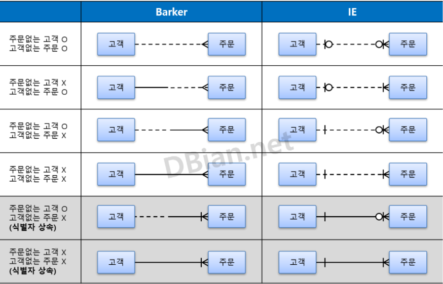
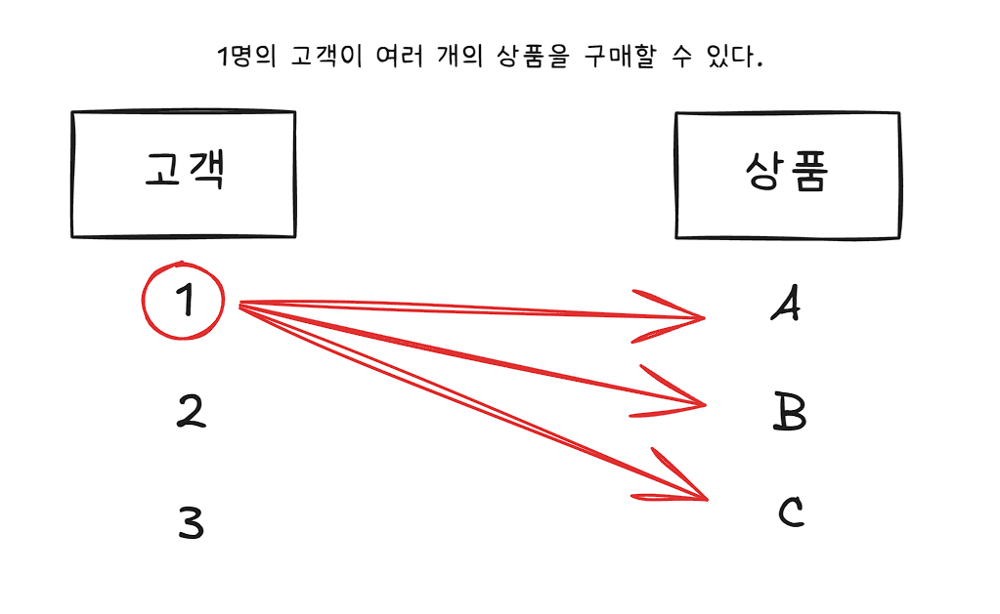
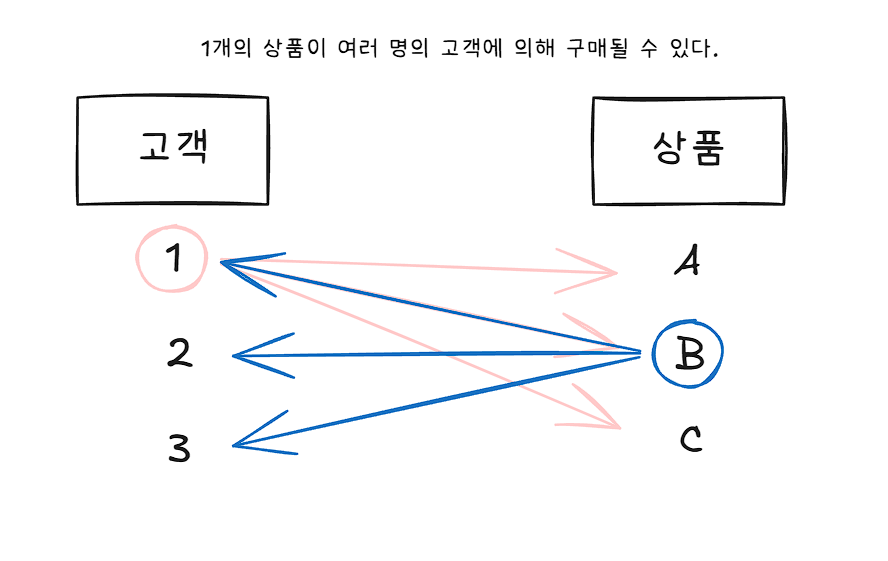
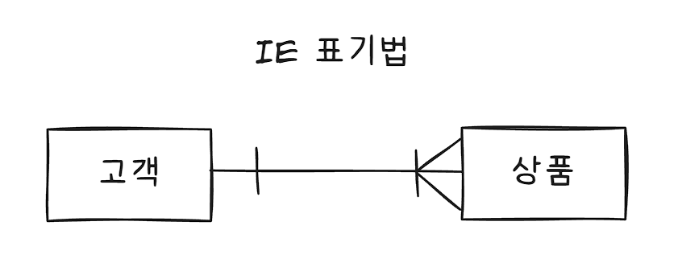
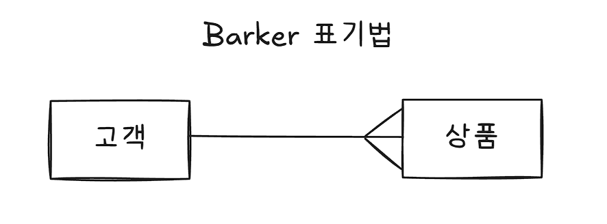

# 개요

그동안 다양한 툴을 사용해 ERD를 그리다 보면 엔티티 간의 연결되는 실선의 양 끝에 직선, 동그라미, 꺽쇠같은 기호들이 붙는 걸 많이 봤다. 얼핏 전공 수업에서 1:M, N:M 등의 관계와 필수적인지 등을 나타내는 표기법이라고 배웠던 기억은 나는데, 정확히 짚고 암기해본 적은 또 없었던 것 같다.

사실 가장 기초가 되는 요소들이라 진즉에 이해하고 알아둬야 했지만 ㅋㅋ.. 지난 날을 반성하며 지금이라도 확실하게 정리하고 이해하고 넘어가보려고 한다.
(그리고 SQLD 1과목에서 IE, Barker 표기법 해석 능력은 필수라고 한다 😱)

그래서 관계형 모델에서 관계란 무엇이고 어떻게 분류되는지, 어떻게 표기하고 어떻게 해석하는 지 정리해본다!

# 관계란?

SQLD 이론서 및 전공책에 나오는 관계의 정의는 이러하다.

> 관계란 두 개 이상의 엔티티 간에 논리적으로 연결된 의미 있는 연관성을 말한다.

예를 들어 '학생'과 '학과'라는 두 엔티티가 있다고 가정하면, 학생 엔티티와 학과 엔티티 사이에는 '소속'이라는 논리적 관계가 존재할 수 있다. 그리고 이를 통해 '어떤 학생이 어떤 학과에 소속되어 있다'는 의미 있는 정보를 만들어낼 수 있다.

그래서 관계형 데이터베이스란? 엔티티 간의 관계를 이용해 새로운 데이터를 조합하고 새로운 정보를 만들어낼 수 있는 데이터베이스라고 하는거다.

# 관계의 분류

관계는 형성 목적에 따라 `존재적 관계`와 `행위적 관계`로 나눌 수 있다.

| 분류        | 설명                            | 예시                                                   |
| ----------- | ------------------------------- | ------------------------------------------------------ |
| 존재적 관계 | 단순히 소속되거나 포함되는 관계 | 학생 <-> 학과 (소속되다)                               |
| 행위적 관계 | 행위로 인해 연결되는 관계       | 회원 <-> 상품 (구매하다), 사용자 <-> 게시글 (작성하다) |

# 관계 표기 및 읽는 방법

이전에 데이터 모델링 과정 중 가장 첫 과정인 `개념적 모델링 과정`에서 엔티티를 생성하고 관계를 선으로 나타낸다고 배웠다.
그런데 이때 단지 선으로 엔티티를 이어주기만 하는 것이 아니라 `관계명`, `관계 차수`, `관계 선택성` 요소를 추가함으로써 더 많은 정보를 표현할 수 있게 된다.

## 관계 표현 3요소

관계를 표현하기 위해서는 다음의 3가지가 필요하다.

- 관계명
- 관계 차수
- 관계 선택성

말 그대로 두 엔티티간의 관계를 나타내기 위해 **관계의 이름**이 필요하고, 엔티티 내의 인스턴스가 각각 관계에 얼마나 참여하는지 **관계 차수**를 표현해야 하며, 엔티티 내의 인스턴스가 관계에 반드시 참여해야 하는지 **관계 선택성**을 표현해야 한다.

### 1. 관계명(Membership)

말 그대로 관계명을 적어주는 것. 엔티티를 이어주고 그 사이에 논리적인 관계를 **"현재형의 동사"**로 표현한다. 이때 애매한 표현이나 과거/미래 시제로 작성하지 않도록 주의해야 하며, 관계명은 두 엔티티 간의 연결이므로 양방향 해석이 가능하다.

### 2. 관계 차수(Degree/Cardinality)

흔히 말하는 1:M, N:M 처럼 ERD에서 두 엔티티 사이에 인스턴스가 몇 개씩 대응될 수 있는지를 나타내는 개념이다.

쉽게 말하면 다음 질문에 대한 답이라고 생각할 수 있을 것 같다.

> A 하나가 B 몇 개와 관계될 수 있는가?
> B 하나가 A 몇 개와 관계될 수 있는가?

예시는 다음과 같다.

위와 같이 **1명의 고객이 여러 개의 상품을 살 수 있는 경우** 다음과 같이 관계 차수를 표기하는데

**1명의 고객은 1개의 상품 혹은 여러 상품을 구매할 수 있다**고 해석한다.

반대의 경우도 마찬가지다. 위와 같이 **1개의 상품이 여러 명의 고객에 의해 구매될 수 있는 경우** 다음과 같이 관계 차수를 표기한다.

**1개의 상품은 1명의 고객 혹은 여러 명의 고객에 의해 구매될 수 있다**고 해석한다.

그래서 관계차수의 종류는 다음과 같은 세 가지가 있다.

| 관계차수 | 의미                         | 예시                |
| -------- | ---------------------------- | ------------------- |
| `1:1`    | A 하나가 B 하나와 관계       | 회원 - 회원상세정보 |
| `1:N`    | A 하나가 B 여러 개와 관계    | 회원 - 주문         |
| `N:M`    | A 여러 개가 B 여러 개와 관계 | 고객 - 상품         |

#### IE 표기법

IE 표기법에서는 N, M 같은 `다`를 < 같은 꺽쇠로 표현하고, `하나`를 | 로 표현한다.

#### Barker 표기법

Barker 표기법에서는 N, M 같은 `다`를 < 같은 꺽쇠로 표현하고, `하나`를 따로 표현하지 않는다.

#### 데이터 관점

이제 관계 차수란 무엇이고 어떻게 표시하며 읽는지는 이해가 됐고, 이걸 실제 데이터 관점에서 살펴보면 좋을 것 같다.

위와 같은 관계를 가지는 교수 엔티티와 학과 엔티티가 있다고 했을 때, 위 관계를 해석하면 다음과 같다.

1. 한 명의 교수는 한 개의 학과에 소속된다.
2. 한 개의 학과는 한 명의 교수 혹은 여러 명의 교수를 소속한다.

그리고 이를 실제 데이터 관점에서 보면 다음과 같은데

[교수]

| 교수 ID (PK) | 교수명 | 소속 학과 코드 (FK) |
| ------------ | ------ | ------------------- |
| P001         | 교수1  | D001                |
| P002         | 교수2  | D001                |
| P003         | 교수3  | D002                |
| P004         | 교수4  | D003                |

[학과]

| 학과 ID (PK) | 학과명             |
| ------------ | ------------------ |
| D001         | 컴퓨터공학과       |
| D002         | 전자정보통신공학과 |
| D003         | 호텔경영학과       |
| D004         | 경영학과           |

한 명의 교수는 한 개의 학과에 소속되므로 학과 ID 의 PK를 받아와 외래키로 사용해도 좋다.

> 여기서 교수 테이블에 학과 ID를 받아오는 이유가 뭘까?

학과 테이블에 교수 ID를 받아와서 표현하는 방법도 있을 텐데 왜 꼭 교수 테이블에 학과 ID를 받아와 FK로 사용하는지에 대한 의문이 들 수 있다.
이는 정규화의 관점을 고려한 구조인데, 만약 학과 테이블에 교수ID를 넣는다면 다음과 같은 문제점이 생긴다.

1. 반복 컬럼이 생긴다.

| 학과ID (PK) | 학과명       | 교수ID1 | 교수ID2 | 교수ID3 |
| ----------- | ------------ | ------- | ------- | ------- |
| D001        | 컴퓨터공학과 | P001    | P002    | P003    |

반복 컬럼이 생기면 제 1 정규화 관점에서 좋지 않다. 교수가 늘어나면 교수ID 를 계속 추가해야 한다는 문제가 생긴다.

2. 반복 행이 생긴다.

| 학과ID | 학과명       | 교수ID |
| ------ | ------------ | ------ |
| D001   | 컴퓨터공학과 | P001   |
| D001   | 컴퓨터공학과 | P002   |
| D001   | 컴퓨터공학과 | P003   |

이러면 학과ID, 학과명 같은 학과 정보가 반복된다. 학과명이 바뀌면 여러 행을 수정해야 하고, 일부만 수정되면 데이터 불일치가 생기는 등 수정이상이 생길 수 있다.

> 🤔 일반적인 다대일(N:1) 관계에서는 일(1) 쪽 엔티티가 부모, 다(N) 쪽 엔티티가 자식인게 맞나?

그러하다!
왜나하면 **교수 1명은 1개의 학과에 소속**되고, **학과 하나는 여러 교수**를 가질 수 있기 때문에 **여러 교수 행들이 같은 학과 ID를 참조**하는 구조가 된다.

> 🤔 그렇다면 N:M 같은 다대다 관계에서는 부모-자식 관계가 어떻게 결정되나?

N:M 관계에서는 두 엔티티 중 하나가 바로 부모/자식이 되는게 아니라, 중간 테이블이 생기고 그 중간 테이블의 양쪽 자식이 된다.

즉, N:M 관계를 풀면 최종적으로는 1:N 관계 두 개가 되고 각각에서 N쪽인 중간 테이블이 자식 테이블이 되는 것이다.

> 🤔 그럼 일대일 관계는 어떻게 처리하는 것이 좋은가?

다음과 같이 회원-회원정보 관계가 있고, 일대일 관계라고 해보자.

[회원]

| 회원ID (PK) | 이메일     |
| ----------- | ---------- |
| C001        | a@test.com |
| C002        | b@test.com |

[회원정보]

| 회원ID (PK, FK) | 이름   | 주소 |
| --------------- | ------ | ---- |
| C001            | 김철수 | 서울 |
| C002            | 이영희 | 부산 |

위와 같이 `회원 정보`의 PK에 `회원`의 PK 를 넣어서 식별 관계(혹은 강한 식별 관계)로 만들어버리는 방법이 있고

| 회원정보ID (PK) | 회원ID (FK, UNIQUE) | 이름   | 주소 |
| --------------- | ------------------- | ------ | ---- |
| I001            | C001                | 김철수 | 서울 |
| I002            | C002                | 이영희 | 부산 |

혹은 위와 같이 `회원정보ID` 라는 PK 컬럼을 두고, `회원 ID`를 FK로 받아와 사용하는 컬럼을 두는 방법이 있다. 이때 `회원ID` 컬럼에는 반드시 `UNIQUE` 제약조건을 걸어줘야 한다. (FK 자체는 중복 허용하니까)

### 3. 관계 선택성(Optionality)

#### IE 표기법

#### Barker 표기법
