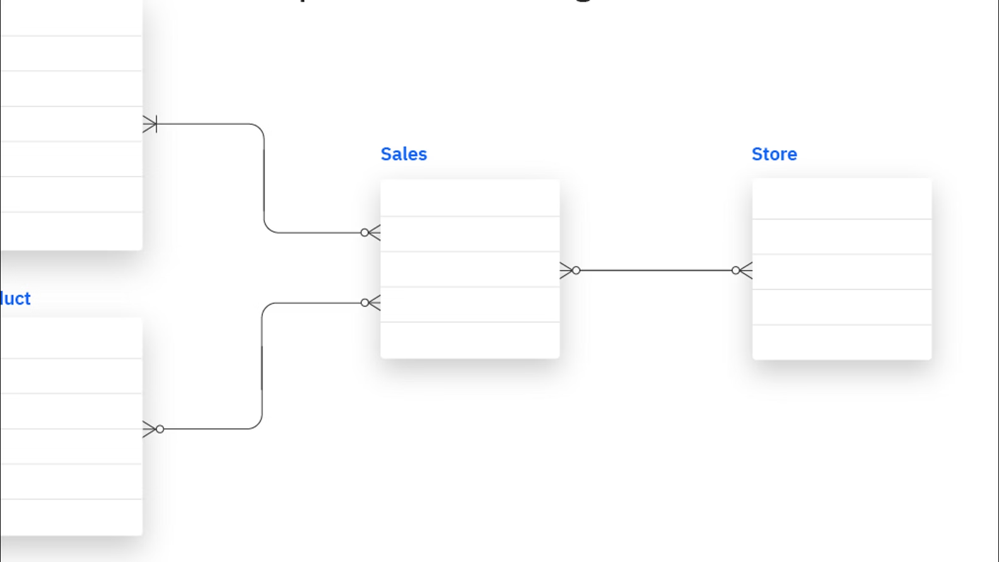
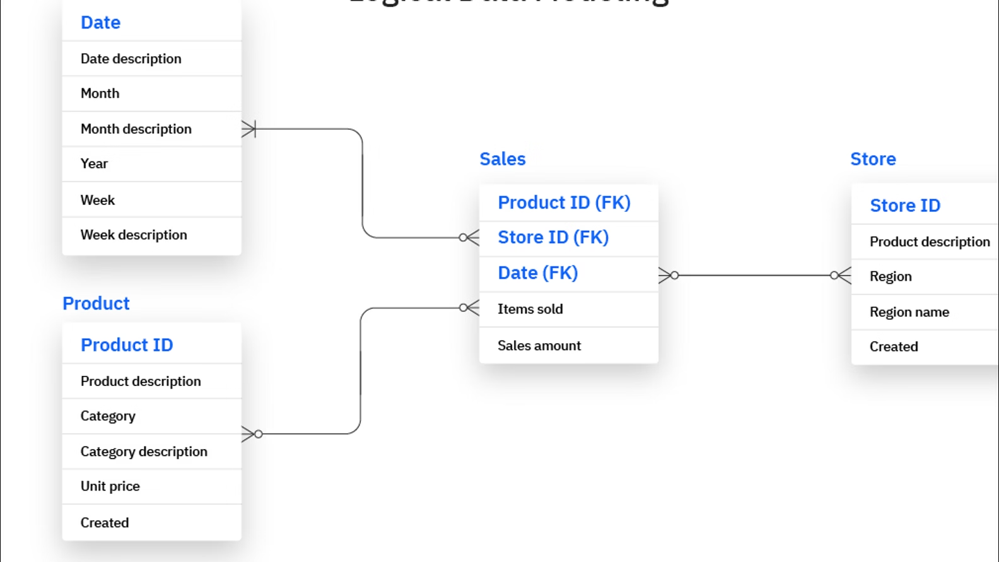
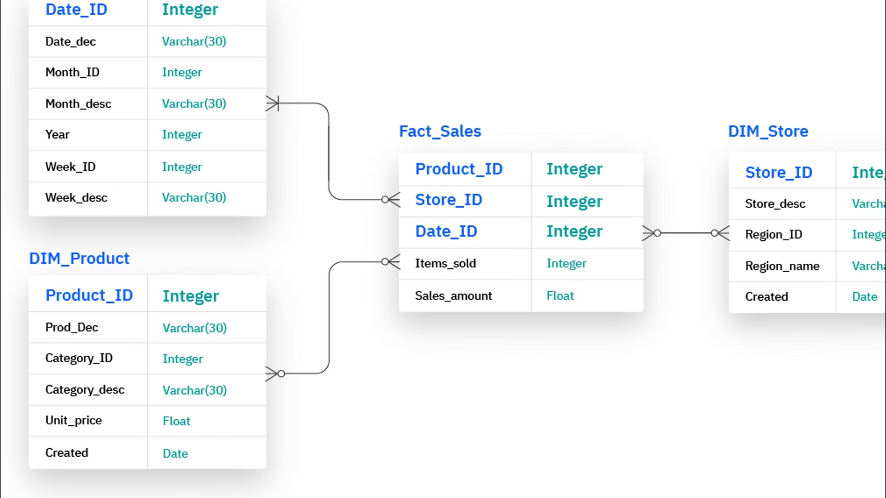

## 개요

프로젝트를 진행하면 항상 기획 회의를 가장 먼저 하고, 그 다음에 바로 ERD 도출 작업을 진행했던 것 같다. 회의 결과 나온 요구사항을 바탕으로 어떻게 DB를 설계할 지 고민했던 것 같은데, 프로젝트를 진행하면서 요구사항은 끊임없이 바뀔 수 있고 여러가지 현실 세계의 상황들로 인해 다양한 변수가 발생하기 마련이다.
그리고 변수가 많이 발생할수록 단단한 설계의 중요성이 빛을 발하게 되는데, 지금까지의 DB 설계는 과연 단단한 설계였는가? 라고 생각해본다면 꼭 그렇지는 않았던 것 같기도 하다.

그래서 SQLD 공부하는 김에, 가장 첫 챕터가 데이터 모델링인 김에 관련해서 정리를 해두면 앞으로 DB 설계하는데 더 많은 도움이 되지 않을까 싶어 한 번 정리해보려고 한다.

## 데이터 모델링이란?

데이터 모델링이란 복잡한 현실 세계의 데이터를 저장하고 활용하기 위해 설계를 수행하는 과정을 말한다.

- 단순화
- 추상화
- 명확화(=해석 용이성)

## 데이터 모델링의 관점

데이터 모델링을 할때는 **단순하게** **추상화**하면서도 **명확**하게 해야 한다는 것은 알겠는데, 그럼 데이터 모델링 과정에서 어떤 관점을 중요하게 생각해야 할까?

3가지의 관점이 있는데 다음과 같다.

1. `데이터 관점 모델링`
2. `프로세스 관점 모델링`
3. `상관 관점 모델링`

### 1. 데이터 관점 모델링

말 그대로 **기능이 어떤 데이터와 관련이 있는지**를 중심으로 모델링하는 방법이다. `회원가입`이라는 기능에 필요한 데이터는 `회원 ID`, `패스워드`, `이름` 등이 있다. 이런 식으로 어떤 데이터가 필요한지의 관점에 따라 모델링하는 것을 **데이터 관점 모델링**이라고 한다.

### 2. 프로세스 관점 모델링

**기능이 어떻게 진행되는지**의 관점에서 모델링하는 방법이다. 사용자가 회원가입을 하려면 다음과 같은 흐름으로 진행되고, 이러한 흐름에서 필요한 데이터를 따오는 방식이다.

```text
(1) 사용자는 회원가입 화면에서 필요한 정보를 입력한다.
(2) 만약 필수 입력 정보를 입력하지 않았으면 알림을 띄운다.
(3) 모든 데이터가 정상 입력되었으면 회원가입 완료 알림을 띄운다.
(4) 로그인 화면으로 이동해서 로그인을 유도한다.
```

### 3. 상관 관점 모델링

**기능에 따라 데이터와 어떻게 작용하는지** 관점에서 모델링하는 방법이라고 한다. `회원가입` 이라는 흐름이 발생한다면 회원 데이터가 `추가(CREATE)`될 것이고, `회원탈퇴` 라는 흐름이 발생한다면 회원 데이터가 `삭제(DELETE)`될 것이다. 이런 관계를 CRUD 매트릭스의 형태로 분석해 표현할 수 있다.

## 데이터 모델링의 중요성

데이터 모델링이란 무엇인지 알았고, 중요하게 생각해야 할 것과 여러 관점에 대해서도 알았는데, 데이터 모델링이 그래서 왜 중요한 걸까?

서두에 언급한 것처럼 소프트웨어 개발에 있어서 견고한 설계만큼 중요한 것이 없을 것 같다. 꾸준히 새로운 요구사항이 생겨나고, 기존의 요구사항이 변경되기도 하며, 새로운 기술의 도입으로 기존의 코드를 수정해야 하는 경우도 많다. 또한 금전적 혹은 다양한 현실 세계의 원인들로 인해 기술 스택이나 툴을 변경하는 경우도 많다.

그런데 만약 정해진 기준이나 규칙 없이 개발되었는데 이렇게 뜯어고치려고 하면 많은 시간과 비용을 들이게 될 확률이 높다. 설령 당장은 그렇지 않은 경우도 있겠지만, 점점 이슈가 쌓여가면서 결국엔 전체 시스템을 수정해야 하는 큰 리스크로 돌아올수도 있다. 그래서 이러한 상황을 방지하기 위해 데이터 구조를 명확히 정의하고 체계적으로 설계하는 데이터 모델링 과정이 중요하다고 하는 것이다!

간단히 정리해보면 다음과 같다.

- 파급 효과 방지
  - 설계 없이 개발을 진행하면 요구사항이 바뀌거나 기능이 추가될 때 구조를 전체 수정해야 할 수 있다.
  - 그리고 이로 인해 예상치 못한 side effect 가 발생할 수 있다.
- 복잡한 정보 요구 사항의 간결한 표현
  - 요구사항이 글로만 정리되어 있다면 다양한 이해관계자가 서로 다르게 해석할 여지가 있다.
  - 복잡한 요구사항을 정해진 규칙에 맞게 글과 그림으로 표현하며 시각화하여 설계도를 제공하는 것이 좋다.
- 데이터 품질
  - 신뢰할 수 있는 고품질 데이터를 만드는 것이 중요하다.
    - `중복`
      - single source 원칙!
    - `비유연성`
      - 데이터와 프로세스 설계가 너무 긴밀하게 연관되어 있으면 기능 변경이나 요구사항 변경이 어렵다.
      - 사소한 기능 변경에도 데이터 설계가 흔들리지 않도록 유연한 설계가 중요하다.
    - `비일관성`
      - 같은 상황인데도 데이터가 다르게 저장되거나 처리되어서는 안된다.

> 그래서 좋은 데이터 모델링이란!
>
> 1. 현업 요구사항과 비즈니스 규칙 반영
> 2. 데이터 중복 방지 및 재사용 가능
> 3. 업무 관련자 간 의사소통 용이
> 4. 데이터의 일관성과 유연성

## 데이터 모델링 과정

데이터 모델링은 다음과 같은 3단계로 진행된다.

```text
(1) 개념적 데이터 모델링   ->   (2) 논리적 데이터 모델링   ->   (3) 물리적 데이터 모델링
```

각 단계가 진행됨에 따라 데이터 모델링이 점점 더 구체적인 설계로 나아가게 된다.

### 1. 개념적 데이터 모델링

개념적 데이터 모델링은 **데이터 모델링의 첫번째 단계**로, **복잡한 기능의 데이터 요구사항을 단순한 그림(ERD)으로 표현하는 과정**이다.


[이미지 출처](https://www.ibm.com/kr-ko/think/topics/data-modeling)

가장 추상화된 설계 단계이고, 요구사항을 `엔티티`, `속성`, `관계`로 추상화하여 단순한 `ERD`로 나타내게 된다.

이때 다양한 DBMS에서 동일하게 ERD를 사용할 수 있기에 DBMS 독립적인 설계 단계다.

### 2. 논리적 데이터 모델링

논리적 데이터 모델링은 **개념적 모델을 바탕으로 데이터의 구조를 상세하게 설계하는 단계**이다. 이때는 실제 구현을 고려해 `속성`, `식별자`, `정규화`, `관계` 등 구체적인 요소를 반영하게 되고, 요구사항을 완전히 반영하기 위한 반복 설계가 이루어진다.



위와 같이 비어있던 엔티티 내부를 채웠음을 확인할 수 있듯 덜 추상적인 단계이고, 특히 `외래키`나 `기본키` 등 속성과 식별자를 정의했음을 확인할 수 있다.

논리적 모델링 단계에서는 정규화도 반드시 고려해야 하는데, `데이터 이상현상(Anomaly)`을 방지하기 위해 엔티티를 적절히 분리해 설계해야 한다.

또한 **원칙적으로는 논리적 모델링 단계에서도 DBMS 독립적으로 설계**해야 한다고는 하는데, 실제 프로젝트에서는 사용할 DBMS의 특성을 염두에 두어 설계하는 경우가 많다.
`MySQL`과 `postgreSQL`의 문법과 기능이 조금씩 다른 것처럼 이미 DBMS를 선정한 뒤 이에 맞게 설계하는 경우가 많아 **사실상 DBMS 종속적인 설계 단계라고도** 볼 수 있겠다.

---

또한 논리적 모델링 과정에서는 다음과 같은 과정으로 작업을 진행하게 된다.

**(1) 엔티티 밑에 속성을 모두 입력**

ERD는 말 그대로 엔티티와 관계만을 이용한 다이어그램이므로 별도의 속성이 없는게 맞다고 한다. (사실 지금까지 ERD라고 했던 것은 ERD +@ 였던 것)

그래서 가장 먼저 엔티티 밑에 속성을 모두 나열해준다.

**(2) 속성 중 식별자를 선택**

이제 엔티티마다 유일한 인스턴스임을 구별할 수 있는 식별자가 반드시 하나 필요하다. 그래서 엔티티가 보유한 여러 속성 후보중에서 식별자가 될 수 있는 속성 조합을 선택해 식별자로 정의한다.

> IE 방식, Barker 방식 표기법도 공부해두면 좋다!
>
> - `IE`: 가로선을 기준으로 위에 식별자, 아래는 일반 속성
> - `Barker`: 속성중에 `#` 붙은 속성이 식별자, `*` 는 필수 속성, `o` 는 선택 속성

**(3) 정규화 수행**

데이터의 이상현상이 발생하지 않도록 정규화를 해주는데, 추후 자세히 정리해볼 계획이다.

**(4) 엔티티 간의 관계 설정**

정규화를 통해 엔티티가 분리되었으니 서로 연관될 수 있도록 관계를 정해주는 작업이다. **부모 엔티티의 `식별자 속성`을 자식 엔티티에 `외래키 속성`으로 부여**해 관계를 설정한다.

**(5) 관계가 N:N 이라면 1:N, N:1 로 해소**

이것도 정규화의 일종인데, N:N 관계의 엔티티를 그대로 하나의 테이블에 표현하면 다음과 같다.

예를 들어 다음과 같은 `학생 N : N 과목` 예시를 들 수 있는데, 이 상황에서 여러 이상현상이 발생할 수 있다.

| 학생ID | 학생명 | 과목ID | 과목명       | 교수명 | 성적 |
| ------ | ------ | ------ | ------------ | ------ | ---- |
| 1      | 김철수 | 101    | 데이터베이스 | 이교수 | A    |
| 1      | 김철수 | 102    | 운영체제     | 박교수 | B    |
| 2      | 이영희 | 101    | 데이터베이스 | 이교수 | A+   |

#### 1. 삽입 이상

새로운 과목을 추가하고 싶으면 아래와 같이 이상한 row가 생겨난다.

| 학생ID | 학생명 | 과목ID | 과목명   | 교수명 | 성적 |
| ------ | ------ | ------ | -------- | ------ | ---- |
| NULL   | NULL   | 103    | 자료구조 | 최교수 | NULL |

#### 2. 수정 이상

같은 정보가 여러 행에 중복되어 있어서, 수정할 때 여러 곳을 모두 바꿔야 하는 문제가 있다.
그리고 이 과정에서 오류나 실수가 발생하면 데이터 불일치가 발생한다.

#### 3. 삭제 이상

삭제하고 싶은 데이터만 삭제했는데, 보존해야 할 데이터까지 같이 사라지는 문제가 생길 수 있다.

유일하게 이영희 학생만 데이터베이스를 수강하는데 삭제해버린다면 데이터베이스 과목 정보 자체가 사라질 수 있다.

| 학생ID | 학생명 | 과목ID | 과목명       | 교수명 | 성적 |
| ------ | ------ | ------ | ------------ | ------ | ---- |
| 2      | 이영희 | 101    | 데이터베이스 | 이교수 | A+   |

> 그래서 이걸 중간 테이블을 둬서 1:N, N:1 로 해소할 수 있다!

#### 1. 삽입 이상 해결

새 과목이 생기면 과목 테이블에만 넣으면 되고, 아직 수강 학생이 없어도 문제 없다.

```
과목(103, 자료구조, 최교수)
```

#### 2. 수정 이상 해결

교수명이 바뀌면 과목 테이블의 한 행만 수정하면 되며 여러 수강 기록을 전부 수정할 필요가 없다.

```
과목ID 101의 교수명만 수정
```

#### 3. 삭제 이상 해결

학생의 수강 기록을 삭제해도 학생 정보와 과목 정보는 그래도 남고, 삭제하고 싶은 관계 정보만 삭제할 수 있다.

```
수강 테이블에서만 삭제
학생 테이블은 유지
과목 테이블은 유지
```

### 3. 물리적 데이터 모델링

물리적 데이터 모델링은 논리적 모델을 기반으로 실제 데이터베이스에 적용할 수 있는 구조로 변환하는 과정이다.

SQL을 이용해 테이블을 생성하고, 속성의 자료형, 크기, 저장 방식 등 물리적인 요소까지 함께 설계한다.



이때 물리적 데이터 모델링의 특징 중 하나는 `반정규화`다.

이전의 `논리적 데이터 모델링` 과정에서는 **이상현상을 막기 위해** 정규화를 통해 엔티티를 분리했다면, `물리적 데이터 모델링` 과정에서는 **성능을 높이기 위해** 일부 엔티티를 통합하거나 일부 중복을 허용하는 반정규화 작업을 할 수 있다!

## 참고 자료

[[AWS] 데이터 모델링이란 무엇인가요?](https://aws.amazon.com/ko/what-is/data-modeling/)
