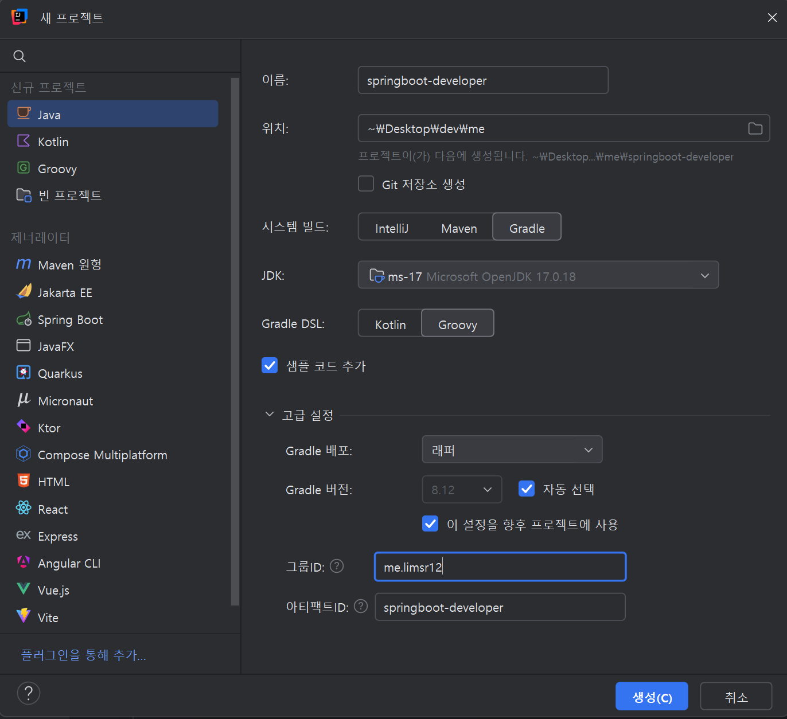
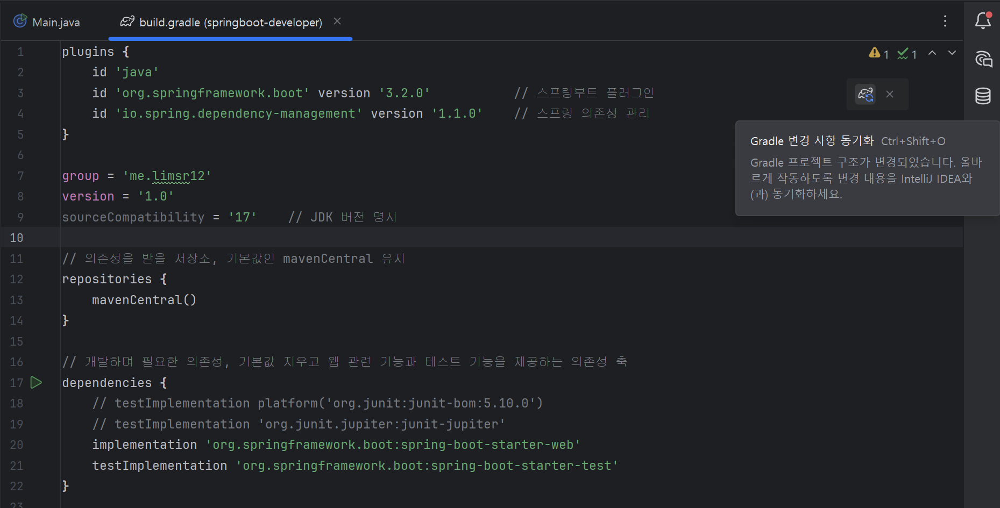

# 인텔리제이에서 프로젝트 생성하기

자바 프로젝트는 생성할 때 설치되어있는 JDK 를 선택하거나, 없다면 새로 설치해야 한다.
버전과 밴더의 종류가 다양하다.

일반적으로 LTS 버전을 사용하고, 밴더는 알아서!

## 그레이들 프로젝트 생성



### Build system의 그레이들과 메이븐의 차이?

그레이들과 메이븐은 둘 다 자바 생태계에서 널리 사용하는 **빌드 관리 도구**다.
소스코드를 빌드하는 과정에서 필요한 것들을 관리하고 자동화하는 도구를 **빌드 관리 도구**라고 한다.

빌드 관리 도구가 하는 작업에는 의존성 다운로드, 코드 패키징, 컴파일, 테스트 실행 등이 있는데, 예전에는 메이븐을 많이 사용했으나 요즘은 그레이들을 많이 사용한다고 한다.

> 왜?

- 메이븐에 비해 가독성이 좋고 설정이 간단하다.
- 자바, 코틀린, 그루비 등 다양한 언어를 지원하고, 원하는대로 빌드 스크립트 작성도 가능하다.
- 빌드 및 테스트 속도가 메이븐보다 빠르다.

## 그레이들 프로젝트를 스프링부트 프로젝트로

`build.gradle` 을 수정하면 된다!

처음 생성하면 다음과 같이 `build.gradle` 이 생성되어있다.

#### 수정 전

```groovy
plugins {
    id 'java'
}

group = 'me.limsr12'
version = '1.0-SNAPSHOT'

repositories {
    mavenCentral()
}

dependencies {
    testImplementation platform('org.junit:junit-bom:5.10.0')
    testImplementation 'org.junit.jupiter:junit-jupiter'
}

test {
    useJUnitPlatform()
}
```

#### 수정 후

```groovy
plugins {
    id 'java'
    id 'org.springframework.boot' version '3.2.0'           // 스프링부트 플러그인
    id 'io.spring.dependency-management' version '1.1.0'    // 스프링 의존성 관리
}

group = 'me.limsr12'
version = '1.0'
sourceCompatibility = '17'    // JDK 버전 명시

// 의존성을 받을 저장소, 기본값인 mavenCentral 유지
repositories {
    mavenCentral()
}

// 개발하며 필요한 의존성, 기본값 지우고 웹 관련 기능과 테스트 기능을 제공하는 의존성 추가
dependencies {
    // testImplementation platform('org.junit:junit-bom:5.10.0')
    // testImplementation 'org.junit.jupiter:junit-jupiter'
    implementation 'org.springframework.boot:spring-boot-starter-web'
    testImplementation 'org.springframework.boot:spring-boot-starter-test'
}

test {
    useJUnitPlatform()
}
```

---

<details>

<summary>⚠️ io.spring.dependency-management 버전에 의한 오류 ⚠️</summary>

### 에러 메시지

```
java.lang.ClassNotFoundException: jakarta.annotation.PostConstruct
java.lang.NoClassDefFoundError: jakarta/annotation/PostConstruct
```

jakarta.annotation.PostConstruct 클래스를 찾을 수 없다는 에러

### 해결 방법

#### 왜 발생하나요?

Spring Boot 3.x + Tomcat 10.x는 jakarta.annotation 패키지를 필요로 합니다. 이 패키지는 jakarta.annotation-api 라이브러리에 들어있는데, 이게 클래스패스에 없는 상태입니다.
원래 spring-boot-starter-web을 추가하면 이 의존성이 자동으로 함께 포함되어야 정상입니다. 그런데 로그의 클래스패스를 보면 jakarta.annotation-api JAR 파일이 빠져 있어요.

#### 원인: io.spring.dependency-management 버전 문제

build.gradle의 이 부분이 문제입니다:

```groovy
id 'io.spring.dependency-management' version '1.1.0'
```

**1.1.0 버전은 Spring Boot 3.2.0과 함께 사용하기에 너무 낮은 버전**입니다. **의존성 BOM(Bill of Materials)**을 제대로 처리하지 못해서 **전이 의존성(transitive dependency)** 일부가 누락됩니다.

#### ✅ 해결 방법

build.gradle에서 버전을 올려주세요:

```groovy
plugins {
  id 'java'
  id 'org.springframework.boot' version '3.2.0'
  id 'io.spring.dependency-management' version '1.1.4' // ← 이 부분 수정
}
Spring Boot 3.2.x와 공식적으로 호환되는 버전은 1.1.4 이상입니다.
```

</details>

---

위와 같이 수정이 완료되면 아래와 같이 gradle 변경사항 동기화를 눌러줘야 한다!
`인텔리제이 단축키 : Ctrl+Shift+O`



이후 gradle 파일에 수정한대로 의존성을 설치하게 된다.

## 패키지 및 애플리케이션 클래스 생성

import 가 끝나면 `src/main/java` 에 `me.limsr12` 패키지가 생성되어 있고, 하위에 프로젝트 패키지를 생성한다.

```
src/main/java/me/limsr12/springbootdeveloper
```

그리고 이 패키지 안에 스프링 부트를 실행할 클래스를 만든다.
클래스 이름은 `<프로젝트이름><Application>` 형식으로 짓는다.

```
SpringBootDeveloperApplication
```

이 클래스가 메인 클래스가 되고, 다음과 같이 작성한다.

```java
package me.limsr12.springbootdeveloper;

import org.springframework.boot.SpringApplication;
import org.springframework.boot.autoconfigure.SpringBootApplication;

@SpringBootApplication
public class SpringBootDeveloperApplication {
    public static void main(String[] args) {
        SpringApplication.run(SpringBootDeveloperApplication.class, args);
    }
}
```

### 내부 동작 흐름

1. SpringApplication 생성

- Spring Boot가 내부적으로 애플리케이션 환경 준비
- application.properties 같은 설정 파일을 읽어온다

2. `@SpringBootApplication`

이건 사실 다음 3개의 어노테이션이 합쳐진거다!

- `@Configuration` -> 설정 클래스
- `@ComponentScan` -> 패키지 탐색
- `@EnableAutoConfiguration` -> 자동 설정

요약하면 현재 페이지를 기준으로 아래를 전부 스캔한다!

3. Bean 등록

- @Controller
- @Service
- @Repository

같은 클래스들을 찾아서 **Spring 컨테이너**에 **객체(Bean)**로 등록

4. 자동 설정 (Auto Configuration)

여기가 Spring Boot 의 핵심이다.

웹 의존성이 있으면 내장 톰캣을 실행하고, DB 의존성이 있으면 DataSource를 자동으로 생성한다.

5. 내장 서버 실행

Spring Boot 는 기본적으로 **Apache Tomcat** 을 내장하고 있다.

- 톰캣 실행
- 포트 8080 열림
- HTTP 요청 받을 준비 완료
