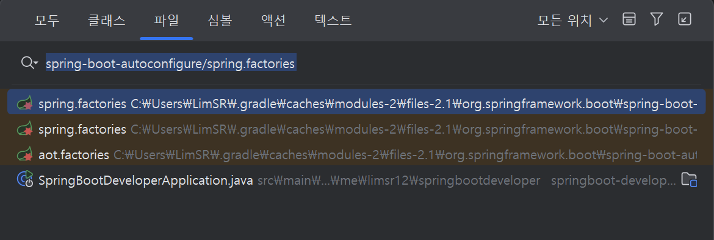
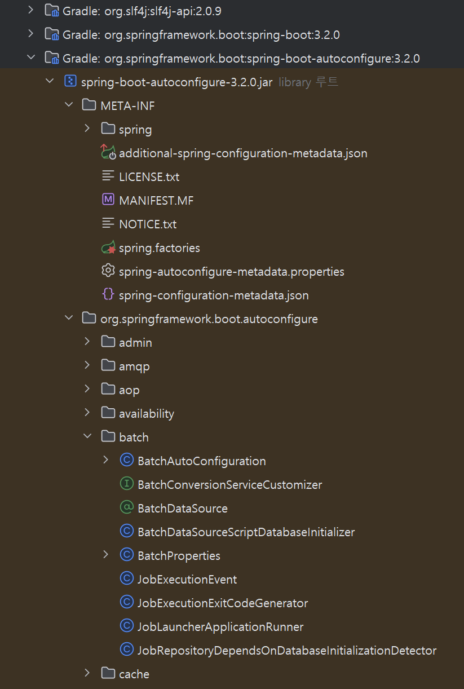

# 개요

목표 : 스프링 부트 3의 상위 프레임워크인 스프링과 비교하며 스프링 부트 3에 대해 알아보고, 스프링의 컨셉인 IoC와 DI, AOP, PSA 를 알아본다.

핵심 키워드 : `IoC(제어의 역전)`, `DI(의존성 주입)`, `AOP(관점 지향 프로그래밍)`, `PSA(이식 가능한 서비스 추상화)`

---

## 스프링의 등장

> 엔터프라이즈 애플리케이션

대규모의 복잡한 데이터를 관리하는 애플리케이션을 말한다.
은행 시스템을생각해보면 몇 백만, 몇 천만의 사용자가 한번에 잔고 조회를 하고 입금/출금 요청을 하거나 새로운 통장을 개설한다. 이렇게 많은 사용자의 요청을 동시에 처리해야 하므로 서버 성능과 안정성, 보안성이 배우 중요해졌다.

그러나 이런 모든 것들을 신경쓰며 비즈니스 로직을 개발하는 것은 매우 어렵다.

2003년 6월, 서버 성능, 안정성, 보안을 매우 높은 수준으로 제공하는 `스프링 프레임워크`가 등장했다.

## 스프링 부트

스프링은 장점이 매우 많은 프레임워크였지만, **설정이 매우 복잡하다**는 단점이 있었다.
2013년 4월 `0.5.0.M6` 버전으로 첫 `스프링 부트`가 출시되었다.

스프링 부트는 빠르게 스프링 프로젝트를 설정할 수 있고, 의존성 세트라고 불리는 스타터를 사용해 간편하게 의존성을 사용하거나 관리할 수 있다.

### 스프링 프레임워크와 비교했을 때 스프링 부트의 특징

- 톰캣, 제티, 언더토우 같은 WAS가 내장되어 있어서 따로 설치하지 않아도 독립적으로 실행 가능하다.
- 빌드 구성을 단순화하는 스프링 부트 스타터를 제공한다.
- 복잡한 XML 설정 없이 자바 코드만으로 모든 것을 작성 가능하다.
- JAR 를 이용해서 자바 옵션만으로도 배포가 가능하다.
- 애플리케이션의 모니터링 및 관리 도구인 Spring Actuator 를 제공한다.

그래서!
스프링 애플리케이션은 일반적으로 톰캣과 같은 WAS 를 통해 배포된다. 그런데 스프링 부트는 WAS 를 내장하고 있어 jar 파일만 만들면 별도로 WAS 설정 없이 애플리케이션을 실행할 수 있다.

스프링 부트의 내장 WAS 에는 톰캣, 제티, 언더토우가 있어서 상황에 따라 선택할 수도 있다.

|                       | 스프링                                          | 스프링부트                                   |
| --------------------- | ----------------------------------------------- | -------------------------------------------- |
| 목적                  | 엔터프라이즈 애플리케이션 개발을 더 쉽게 만들기 | 스프링의 개발을 더 빠르고 쉽게 하기          |
| 설정 파일             | 개발자가 수동 구성                              | 자동 구성                                    |
| XML                   | 일부 파일은 XML로 직접 생성, 관리               | 사용하지 않음                                |
| 인메모리 데이터베이스 | 지원하지 않음                                   | 자동 설정 지원 (H2)                          |
| 서버                  | 프로젝트를 띄우는 서버에 별도로 수동 설정       | 내장형 서버를 제공해 별도의 설정이 필요 없음 |

# 중요! 스프링의 Concept

## 1️⃣ IoC (제어의 역전)

> Inversion of Control

[IoC 정리 문서 바로가기](../IoC.md)

### 핵심 정의

> 객체 생성과 의존성 관리의 주도권을 개발자가 아니라 프레임워크가 가지는 것

원래 자바에서 객체를 생성할 때는 객체가 필요한 곳에서 직접 생성한다.

그러나 제어의 역전은 다른 객체를 직접 생성하거나 제어하는 것이 아니라, 외부에서 관리하는 객체를 가져와 사용하는 것을 말한다.

#### 예시

```java
// 클래스 A에서 클래스 B 객체 생성
public class A {
  b = new B(); // 클래스 A에서 new 키워드로 클래스 B의 객체 생성
}
```

```java
// 스프링 컨테이너가 객체를 관리하는 방식
public class A {
  private B b; // 코드에서 객체를 생성하지 않고, 어디선가 받아온 객체를 b에 할당!
}
```

### 왜 필요한가?

다음과 같이 강한 결합의 코드를 느슨한 결합으로 만들어줄 수 있다!

#### 기존 방식 (강한 결합)

```java
class OrderService {
    private PaymentService paymentService = new PaymentService();
}
```

- 여기서 만약 PaymentService 가 바뀌면 코드 수정이 필요하다.
- Mock 주입이 불가능해서 테스트도 어렵다.
- 유연성은 낮아지고 결합도는 올라간다.

#### IoC 적용 (느슨한 결합)

```java
class OrderService {
    private PaymentService paymentService;

    public OrderService(PaymentService paymentService) {
        this.paymentService = paymentService;
    }
}
```

- 객체 생성은 스프링 컨테이너가 담당한다

## 2️⃣ DI (의존성 주입)

> Dependency Injection

말 그대로 어떤 클래스가 다른 클래스에 의존한다는 뜻.

## 스프링 컨테이너

스프링은 스프링 컨테이너를 제공한다.
스프링 컨테이너는 빈을 생성하고 관리한다.
빈이 생성되고 소멸되기까지의 생명 주기를 이 스프링 컨테이너가 관리한다.

개발자가 `@Autowired` 같은 어노테이션을 사용해 빈을 주입받을 수 있게 DI도 지원한다.

## 빈 (Bean)

스프링 컨테이너가 생성하고 관리하는 객체다.

스프링은 빈을 스프링 컨테이너에 등록하기 위해 XML 파일 설정, 어노테이션 추가 등의 방법을 제공하는 등 빈을 등록하는 방법은 여러가지가 있다.

예를 들어 MyBean 이라는 클래스에 @Component 어노테이션을 붙이면 MyBean 클래스가 빈으로 등록되고, 이후 스프링 컨테이너에서 이 클래스를 관리한다.
이때 빈의 이름은 클래스명의 첫 글자만 소문자로 바꿔서 관리한다. (myBean)

```java
@Component
public class MyBean {

}
```

## AOP (관점 지향 프로그래밍)

> Aspect Oriented Programming

프로그래밍에 대한 관심을 핵심 관점, 부가 관점으로 나누어서 관심 기준으로 모듈화 하는 것을 의미한다. (?)

### 예시

예를 들어 `계좌 이체`, `고객 관리`하는 프로그램이 있다고 할 때, 각 프로그램 내에는 또 `로깅` 로직과 `데이터베이스 연결` 로직이 있을 것이다.
이때 **핵심 관점**은 `계좌 이체`, `고객 관리` 로직이고, **부가 관점**은 `로깅`, `데이터베이스 연결` 로직이 된다.

이때 로깅, 데이터베이스 연결은 계좌 이체, 고객 관리에 모두 필요하다.
여기에 AOP 관점을 적용해보면, 부가 관점 코드를 핵심 관점 코드에서 분리해 개발할 수 있게 해준다.
개발자는 핵심 관점 코드에만 집중하게 될 수 있고 변경과 확장에도 유연하게 대응할 수 있다.

# 스프링 부트 스타터

스프링 부트 스타터 (spring-boot-starter-\*) 는 의존성이 모여있는 그룹이다.
`spring-boot-starter-{작업유형}` 이라는 네이밍 컨벤션이 있다.

#### 종류

- `spring-boot-starter-web`
  - spring mvc 를 사용해서 RESTful API를 개발할 때 필요한 의존성 모음
- `spring-boot-starter-test`
  - 스프링 애플리케이션을 테스트하기 위한 의존성 모음
- `spring-boot-starter-validation`
  - 유효성 검사를 위해 필요한 의존성 모음
- `spring-boot-starter-actuator`
  - 모니터링을 위해 애플리케이션에서 제공하는 다양한 정보를 제공하기 쉽게 하는 의존성 모음
- `spring-boot-starter-data-jpa`
  - ORM을 사용하기 위한 인터페이스인 JPA 를 쉽게 사용하기 위한 의존성 모음

## 자동 구성

스프링 부트에서는 애플리케이션이 최소한의 설정만으로도 실행되게 여러 부분을 자동으로 구성한다.
그래서 내가 구성하지 않은 부분인데 스프링에서 어떻게 자동으로 구성했는지 확인해야 할 상황이 오기도 한다.

스프링 부트는 서버를 시작할 때 구성 파일을 읽어와서 설정한다.
자동 설정은 `META-INF`에 있는 `spring.factories` 파일에 담겨있다.

#### 확인 방법

오른쪽 위 돋보기 -> 탭을 Files 로 선택 -> spring-boot-autoconfigure/spring.factories 검색



그럼 다음과 같이 엄청난 양의 텍스트 파일이 나오는데, 스프링 부트를 시작할 때 이 파일에 설정되어 있는 클래스를 모두 불러오고 이후에는 프로젝트에서 사용할 것들만 자동으로 구성해 등록한다.

```
# ApplicationContext Initializers
org.springframework.context.ApplicationContextInitializer=\
org.springframework.boot.autoconfigure.SharedMetadataReaderFactoryContextInitializer,\
org.springframework.boot.autoconfigure.logging.ConditionEvaluationReportLoggingListener

# Application Listeners
org.springframework.context.ApplicationListener=\
org.springframework.boot.autoconfigure.BackgroundPreinitializer

# Environment Post Processors
org.springframework.boot.env.EnvironmentPostProcessor=\
org.springframework.boot.autoconfigure.integration.IntegrationPropertiesEnvironmentPostProcessor

# Auto Configuration Import Listeners
org.springframework.boot.autoconfigure.AutoConfigurationImportListener=\
org.springframework.boot.autoconfigure.condition.ConditionEvaluationReportAutoConfigurationImportListener

# Auto Configuration Import Filters
org.springframework.boot.autoconfigure.AutoConfigurationImportFilter=\
org.springframework.boot.autoconfigure.condition.OnBeanCondition,\
org.springframework.boot.autoconfigure.condition.OnClassCondition,\
org.springframework.boot.autoconfigure.condition.OnWebApplicationCondition

# Failure Analyzers
org.springframework.boot.diagnostics.FailureAnalyzer=\
org.springframework.boot.autoconfigure.data.redis.RedisUrlSyntaxFailureAnalyzer,\
org.springframework.boot.autoconfigure.diagnostics.analyzer.NoSuchBeanDefinitionFailureAnalyzer,\
org.springframework.boot.autoconfigure.flyway.FlywayMigrationScriptMissingFailureAnalyzer,\
org.springframework.boot.autoconfigure.jdbc.DataSourceBeanCreationFailureAnalyzer,\
org.springframework.boot.autoconfigure.jdbc.HikariDriverConfigurationFailureAnalyzer,\
org.springframework.boot.autoconfigure.jooq.NoDslContextBeanFailureAnalyzer,\
org.springframework.boot.autoconfigure.r2dbc.ConnectionFactoryBeanCreationFailureAnalyzer,\
org.springframework.boot.autoconfigure.r2dbc.MissingR2dbcPoolDependencyFailureAnalyzer,\
org.springframework.boot.autoconfigure.r2dbc.MultipleConnectionPoolConfigurationsFailureAnalyzer,\
org.springframework.boot.autoconfigure.r2dbc.NoConnectionFactoryBeanFailureAnalyzer

... 생략
```

그리고 왼쪽 프로젝트 구성에서 외부 라이브러리를 펼쳐보면 다음과 같이 auto configure 관련 파일들을 확인할 수 있다.



# 스프링 부트 3, 자바 17 의 주요 변화

## 텍스트 블록

이전에는 여러 줄의 텍스트를 작성하려면 `\n`을 추가해야 했으나 `"""` 로 감싼 텍스트를 사용해 여러 줄의 텍스트를 표현할 수 있다.

```java
// java 11 버전
String query = "SELECT * FROM \"items\"\n" +
    "WHERE \"status\" = \"ON_SALE\"\n" +
    "ORDER BY \"price\";\n";

// java 17 버전
String query = """
    SELECT * FROM "items"
    WHERE "status" = "ON_SALE"
    ORDER BY "price";
    """;
```

## formatted() 메서드

값을 파싱하기 위한 메서드

## 레코드

레코드는 데이터 전달을 목적으로 하는 객체를 더 빠르고 간편하게 만들기 위한 기능이다.
레코드는 상속을 할 수 없고, 파라미터에 정의한 필드는 private final 로 정의된다.

또한 레코드는 getter 를 자동으로 만들기 때문에 어노테이션이나 메서드로 게터 정의를 하지 않아도 된다.

```java
record Item(String name, int price) {
  // 이렇게 하면 파라미터가 private final 로 정의된다
}

Item juice = new Item("juice", 3000);
juice.getPrice(); // 3000
```

## Servlet, JPA 의 네임스페이스가 Jakarta 로 변경됨

기존 패키지 네임스페이스인 javax._ 에서 jakarta._ 로 변경되었다.

## GraalVM 기반의 스프링 네이티브 공식 지원

스프링 부트 3.0 부터는 GraalVM 네이티브 이미지를 공식 지원한다고 한다. 기존에 사용하던 자바 가상머신에 비해 훨씬 빠르게 시작하고 더 적은 메모리 공간을 차지한다. JVM 실행파일과 비교해 네이티브 이미지를 사용하면 가동 시간이 짧아지고 메모리도 더 적게 소모한다.

# 스프링 부트 3 코드 뜯어보기

SpringBootDeveloperApplication은 현재 스프링 애플리케이션의 메인 진입점이다.

```java
package me.limsr12.springbootdeveloper;

import org.springframework.boot.SpringApplication;
import org.springframework.boot.autoconfigure.SpringBootApplication;

@SpringBootApplication
public class SpringBootDeveloperApplication {
    public static void main(String[] args) {
        SpringApplication.run(SpringBootDeveloperApplication.class, args);
    }
}
```

`@SpringBootApplication` 어노테이션을 추가함으로서 스프링 부트 사용에 필요한 기본 설정을 해주고, SpringApplication.run() 메서드는 애플리케이션을 실행한다.
여기서 첫번째 파라미터는 스프링 부트 애플리케이션의 메인 클래스로 사용할 클래스, 두번째 파라미터는 커맨드 라인의 파라미터다.

## `@SpringBootApplication` 뜯어보기

`@SpringBootApplication` 을 확인해보면 다음과 같다.

```java
@Target(ElementType.TYPE)
@Retention(RetentionPolicy.RUNTIME)
@Documented
@Inherited
@SpringBootConfiguration
@EnableAutoConfiguration
@ComponentScan(excludeFilters = {
  @Filter(type = FilterType.CUSTOM, classes = TypeExcludeFilter.class),
  @Filter(type = FilterType.CUSTOM, classes = AutoConfigurationExcludeFilter.class)
})
public @interface SpringBootApplication {
  ... 생략
}
```

### 1. 메타 어노테이션

쉽게 말하면 어노테이션을 위한 어노테이션으로, 이 어노테이션의 동작 방식을 정의한다.

#### `@Target(ElementType.TYPE)`

- 이 **어노테이션을 어디에 붙일 수 있는지 정의**한다.
- `ElementType.Type` -> 클래스, 인터페이스, enum에만 사용 가능
- 그래서 @SpringBootApplication 은 메서드나 필드에는 붙일 수 없다!

#### `@Retention(RetentionPolicy.RUNTIME)`

- 이 어노테이션 정보를 언제까지 유지할 지 지정한다.
- `RUNTIME` -> JVM이 실행 중에도 리플렉션으로 읽을 수 있다!
- Spring이 실행 중에 어노테이션을 스캔해야 하므로 반드시 RUNTIME 필요하다고 함(?)

#### `@Documented`

- JavaDoc 생성 시 이 어노테이션 정보도 문서에 포함시킨다.
- 실제 동작에 영향을 주지는 않는 어노테이션

#### `@Inherited`

- 부모 클래스에 이 어노테이션이 붙으면 자식 클래스도 자동으로 상속받는다.

### 2. 핵심 기능 어노테이션

실제 스프링 애플리케이션의 핵심 동작을 담당한다.

#### `@SpringBootConfiguration`

- 내부적으로 `@Configuration`을 포함한다.
- 이 클래스가 Spring 설정 클래스임을 선언해주는 역할
- `@Bean` 메서드를 통해 빈 등록도 가능하게 한다.

#### `@EnableAutoConfiguration`

Spring Boot의 **핵심 중의 핵심**이다.

- classpath에 있는 라이브러리를 보고 **설정을 자동으로 추론**해서 적용
- 예를 들어 `spring-boot-starter-web`이 있으면 -> Tomcat, DispatcherServlet 자동 설정
- 내부적으로 `spring.factories` / `AutoConfiguration.imports` 파일을 읽어서 동작

다음과 같은 파일을 읽어서 자동 설정 클래스들을 적용한다.

```
org.springframework.boot.autoconfigure.web.servlet.WebMvcAutoConfiguration
org.springframework.boot.autoconfigure.jackson.JacksonAutoConfiguration
...
```

#### `@ComponentScan`

사용자가 등록한 빈을 읽고 등록하는 어노테이션이다. @Component 붙은 클래스를 찾아 빈으로 등록하는데, 무조건 다 등록하는 건 아니고, 위의 `@EnableAutoConfiguration` 에서 등록한 건 제외하고, 테스트 환경도 제외하고 등록한다!

- **현재 패키지부터 하위 패키지까지** 전부 스캔해서 빈 등록
- `@Component`, `@Service`, `@Repository`, `@Controller` 등을 찾아서 자동 등록

`excludeFilters`로 다음 두 가지를 제외

| 제외 필터                        | 이유                                                                                                 |
| -------------------------------- | ---------------------------------------------------------------------------------------------------- |
| `TypeExcludeFilter`              | 테스트 환경에서 특정 빈을 교체할 수 있도록 테스트 전용 제외 처리                                     |
| `AutoConfigurationExcludeFilter` | `@EnableAutoConfiguration`이 처리할 자동 설정 클래스를 ComponentScan이 **중복 처리하지 않도록** 제외 |

---

### 전체 구조 요약

```
@SpringBootApplication
│
├── 메타 어노테이션 (어노테이션 동작 정의)
│   ├── @Target          → 클래스에만 붙일 수 있음
│   ├── @Retention       → 런타임까지 정보 유지
│   ├── @Documented      → JavaDoc 포함
│   └── @Inherited       → 자식 클래스에 상속
│
└── 핵심 기능 어노테이션
    ├── @SpringBootConfiguration  → 설정 클래스 선언 (@Configuration 포함)
    ├── @EnableAutoConfiguration  → classpath 기반 자동 설정
    └── @ComponentScan            → 빈 자동 스캔 및 등록
```

> 컨트롤러 코드를 보면 `@RestController` 만 붙어있고, `@Component`는 안 붙어있는데 어떻게 빈으로 등록되는거지?
>
> `@RestController` 는 `@Controller` 를 가지고 있고, `@Controller` 는 `@Component` 를 가지고 있다. 다른 것들도 마찬가지로, `@Configuration`, `@Repository`, `@Service` 모두 하위에 `@Component`를 가지고 있으나 **빈이 무슨 역할을 하는지 명확하게 구분하기 위해 다른 이름으로 덮어둔거다!**
