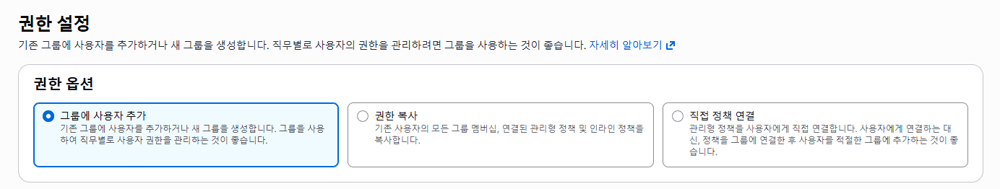
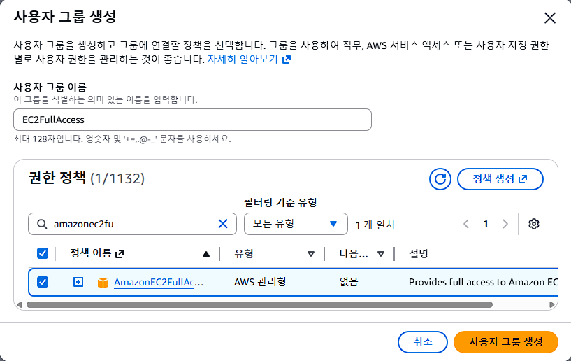
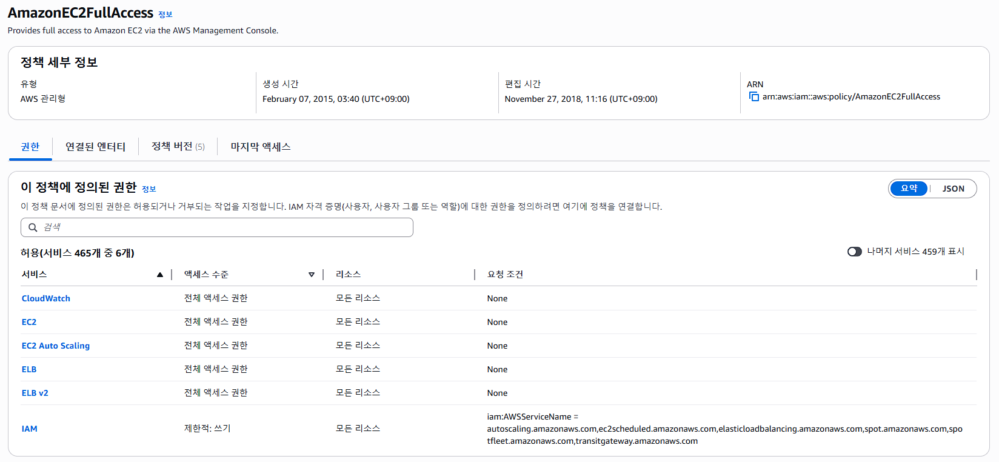
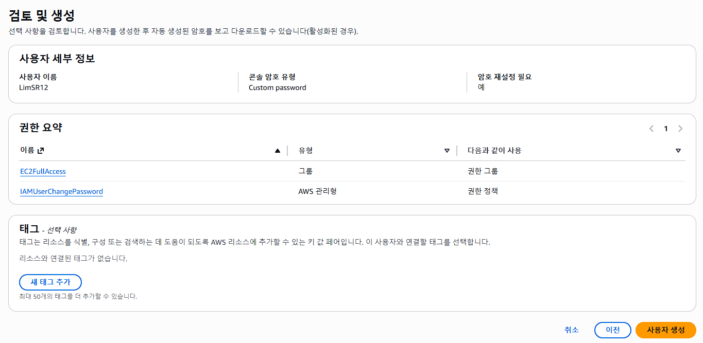
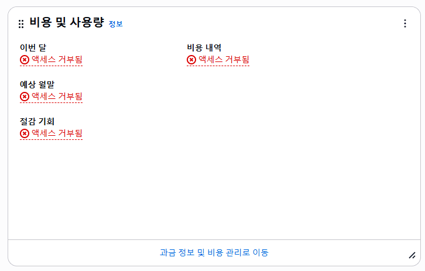

# IAM이란?

# 왜 알아야 하는가?

부스트캠프 백엔드 마스터 클래스 들을 때 호눅스님께서 알려주셨다.

> 여러분 루트 계정으로 들어가서 작업하는 경우 많죠? 근데 그러면 돼요 안돼요? 안됩니다~!!
> 루트 계정은 서브 계정을 생성하고 권한을 부여하는 용도로만 사용하고, 실제 작업은 반드시 서브 계정에 접속해서 해야 하는거에요.

## 정리하면 다음과 같다

#### 루트계정

- AWS 회원가입하면 생기는 최고 권한 계정
- 계정 자체 총 소유자
- 평소 사용은 안하는게 권장사항
- MFA 설정, 결제 정보 관리, 계정 복구, 일부 루트 전용 작업에만 사용 권장

#### 서브 계정

- 실제 운영이나 개발할 때 쓰는 계정
- 필요한 권한만 부여해서 사용
- 보안상 훨씬 안전함

[참고 문서](https://docs.aws.amazon.com/IAM/latest/UserGuide/root-user-best-practices.html)

# IAM 사용자 생성하기

우선 루트 계정으로 로그인한 뒤 IAM 검색해서 들어간다.

### 1. 사용자 생성

사용자 - 사용자 생성 눌러서 사용자를 생성한다. 사용자명과 비밀번호 설정해주고 넘어가면,

### 2. 권한 설정하기

여기서 권한 설정을 3가지 옵션이 있는데, 그룹에 정책을 설정하고 그 그룹에 사용자를 넣어주는 방법 / 기존 사용자의 모든 권한을 복사해서 받아오는 방법 / 직접 정책을 만들어서 해당 사용자에게 부여하는 방법이다.

이중 첫번째, 그룹에 정책 설정한 뒤 사용자를 그룹에 넣어주는 방법이 가장 권장되는 방법이라고 한다.

### 3. 사용자 그룹 선택(혹은 생성)

그래서 위와 같이 그룹을 하나 생성하고 정책을 선택해주는데, 지금은 EC2 에 대한 모든 권한을 부여하는 정책을 설정해봤다.

이때 선택한 정책은 AmazonEC2FullAccess 라는 정책!

### 4. IAM 사용자 생성 완료

그리고 나면 위와 같이 IAM 사용자를 하나 생성할 수 있다.

## 서브계정 로그인하면

EC2 관련 해서는 확인 가능하지만, billing 관련해서는 권한 정책을 선택하지 않았기 때문에 확인할 수 없다!
