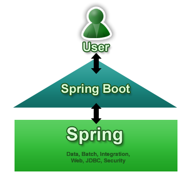

# `Spring Framework` 와 `Spring Boot` 는 뭐가 다른거지?

> `Spring Boot` ⊂ `Spring Framework`

## `Spring Framework` 란?

Spring Framework는 Java 기반의 애플리케이션 개발을 위한 종합 프레임워크이다.

Spring Framework 에는 다음과 같은 핵심 기능들이 있다.

- IoC
- DI
- AOP
- MVC
- 트랜잭션 관리
- JDBC / ORM 연동
- Security 연동 가능

> Spring Framework 란 엔터프라이즈 애플리케이션을 만들기 위한 "기본 설계 철학 + 기능 모음"

## `Spring Framework` 의 문제점

그러나 Spring Framework 는

- 설정이 매우 많고,
- 별도의 WAS 서버를 구성해야 하고,
- XML 설정 지옥에,
- 의존성 관리가 복잡하다 (XML 설정 파일에 수많은 bean 등록)

는 문제점이 있다.

실제로 Spring Framework 를 사용하던 예전 프로젝트는 다음과 같은 작업들이 필요했다고 한다.

- DispatcherServlet 설정
- ComponentScan 설정
- DataSource 설정
- Tomcat 따로 설치
- web.xml 작성
- 의존성 버전 충돌 해결

### 1. DispatcherServlet 설정

`Spring Framework` 는 중앙 컨트롤러 구조라서 모든 HTTP 요청을 Spring 이 받아서 각 컨트롤러로 라우팅해야 한다.

그런데 WAS 는 기본적으로 Spring 을 모른다고 한다.

그래서 Tomcat 서버 입장에서는

> 요청 들어왔는데 이거 누가 처리함?

그리고 Spring 입장에서는

> DispatcherServlet 이라는 애가 받아야 하는데?

즉, Spring 에게 요청을 넘겨주는 진입점이 필요하고, 이걸 개발자가 직접 web.xml 에 등록해야 했다고 한다.

```xml
<servlet>
    <servlet-name>dispatcher</servlet-name>
    <servlet-class>org.springframework.web.servlet.DispatcherServlet</servlet-class>
</servlet>

<servlet-mapping>
    <servlet-name>dispatcher</servlet-name>
    <url-pattern>/</url-pattern>
</servlet-mapping>
```

### 2. ComponentScan 설정

Spring 은 기본적으로 DI 컨테이너인데, 어떤 클래스가 Bean 인지 모르면 DI 자체가 불가능하다.
따라서 "어느 패키지를 뒤져서 Bean을 찾아야 하는지" 알려줘야 했다고 한다.

> Spring이 어떤 클래스들을 관리해야 하는지 스캔 범위를 지정해야 했다!

```xml
<context:component-scan base-package="com.myapp" />
```

### 3. DataSource 설정

Spring은 DB가

- MySQL인지
- Oracle인지
- URL이 뭔지
- 커넥션 풀을 쓸건지

전혀 모른다!

따라서 `Spring Framework` 에서는 DataSource를 직접 Bean으로 만들어야 했다.
(`Spring Boot` 에서는 DB 설정만 주면 Boot가 DataSource + Pool까지 자동 생성한다.)

```xml
<bean id="dataSource" class="org.apache.commons.dbcp.BasicDataSource">
    <property name="url" value="jdbc:mysql://localhost:3306/test"/>
    <property name="username" value="root"/>
    <property name="password" value="1234"/>
</bean>
```

### 4. Tomcat 따로 설치

Spring 은 서버가 아니라 라이브러리였다!
따라서 Tomcat 을 다운로드하고, WAR 빌드하고, Tomcat webapps 에 배포하는 과정이 필요했다.

```bash
mvn package
cp target/app.war tomcat/webapps/
```

### 5. web.xml 작성

어떤 서블릿이 있고, 어떤 필터가 있고, 어떤 리스너가 있는지 WAS (Tomcat) 에 알려주는 xml 문서가 필요했다.

- DispatcherServlet
- ContextLoaderListener
- Filter
- Encoding 설정

> 즉, 애플리케이션의 구조를 XML 로 정의해야 했다

### 6. 의존성 버전 충돌 해결

Spring MVC를 쓰려면

- spring-core
- spring-context
- spring-web
- spring-aop
- jackson
- hibernate
- servlet-api
- jsp-api

등 의존성이 매우 많이 생기는데, 버전이 서로 맞지 않으면 바로 런타임 에러가 난다.

- `NoSuchMethodError`
- `ClassNotFoundException`

> 그래서 개발자가 직접 라이브러리 호환성 매트릭스를 직접 관리해야 했다!

## 그래서 `Spring Boot` 란?

Spring 을 설정 없이 바로 실행 가능하게 만든 것!

`Spring Boot` 의 목표는 **"Convention over Configuration"** (COC) 였다고 한다.

> Spring Boot makes it easy to create stand-alone, production-grade Spring based Applications that you can "just run".
>
> We take an opinionated view of the Spring platform and third-party libraries so you can get started with minimum fuss. Most `pring Boot applications need minimal Spring configuration.
> 출처 : https://spring.io/projects/spring-boot



### `Spring Framework` 와 Boot 의 차이

| 항목      | `Spring Framework`         | `Spring Boot`                           |
| --------- | -------------------------- | --------------------------------------- |
| 설정      | 대부분 수동                | 자동 설정 (Auto Configuration)          |
| 서버      | 직접 설치 필요 (Tomcat 등) | 내장 서버 포함(Tomcat, Jetty, Undertow) |
| 실행      | WAR 배포 필요              | JAR 실행 가능                           |
| 의존성    | 직접 관리                  | Starter로 묶어서 제공                   |
| 초기 세팅 | 복잡                       | 거의 없음                               |
| 실행 방식 | 서버에 올려야 함           | `main()`으로 실행                       |

# 비유하자면

`Spring Framework` = 엔진 + 부품

`Spring Boot` = 완성된 자동차

> `Spring Framework` 는 직접 조립해서 타야 하고, `Spring Boot` 는 시동만 걸면 된다!!
