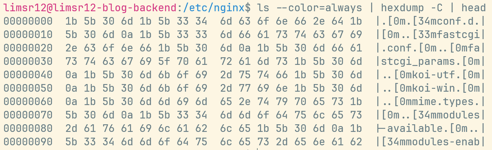
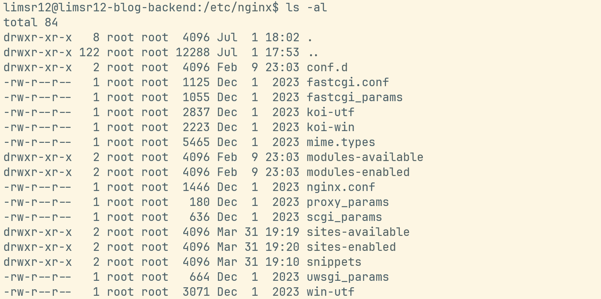
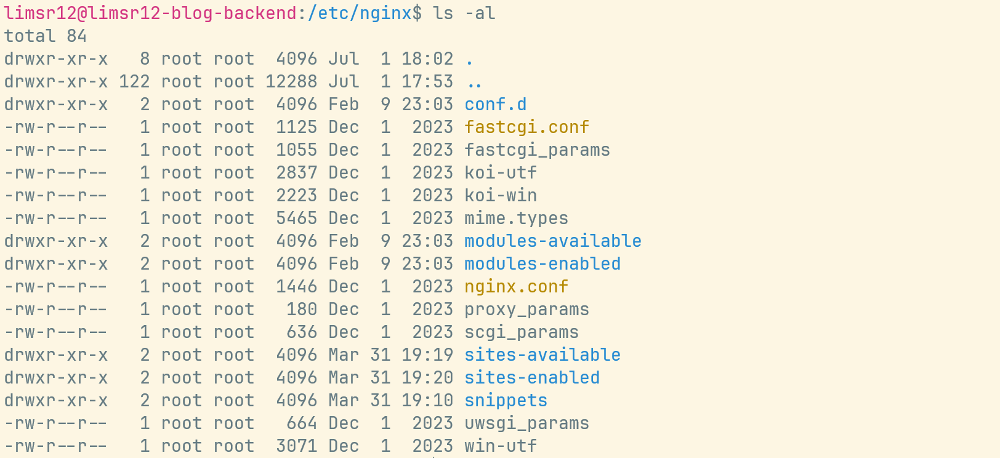

# 개요

윈도우 노트북과 데스크탑을 사용하기에 `PowerShell 7`을 가장 많이 사용하는데, 항상 ssh 접속하면 PuTTy같은 툴을 사용할때와 다르게 색상 구분이 하나도 없었다.

처음엔 파워쉘 설정을 수정하면 되려나 싶었으나, ssh 접속 환경에서는 로컬의 파워쉘은 Ubuntu 머신으로 명령을 전달하고 결과를 받아 보여주기 때문에 Ubuntu 머신의 Bash 설정을 바꿔야 하는게 맞다.

그래서 로컬 파워쉘에서도 ssh 접속했을 때 사용자명, 파일, 디렉토리 등에 색상을 넣어주기 위해 `.bashrc` 파일을 수정해보기로 했다.

## 색상코드 들어오는 방식 뜯어보기

hexdump로 원본 바이트를 분해해보며 확인해볼 수도 있다.

```bash
ls --color=always | hexdump -C | head
```

ssh 접속해서 위와 같이 dump를 따보면 `1b 5b 30 31 3b 33 34 6d` 이런 바이트열이 보이는데, `1b`가 `ESC`, `5b`가 `[`, 나머지가 `01;34m`이다.



그리고 구조를 분해해보면 다음과 같은 식이다.

```
00000000  1b 5b 30 6d 1b 5b 33 34  6d 63 6f 6e 66 2e 64 1b  |.[0m.[34mconf.d.|
─────────  ──────────────────────────────────────────────    ────────────────
  오프셋              16바이트 hex 값                          ASCII 표현
```

| 바이트            | 해석                  |
| ----------------- | --------------------- |
| 1b 5b 30 6d       | ESC[0m — 리셋         |
| 1b 5b 33 34 6d    | ESC[34m — 파란색 시작 |
| 63 6f 6e 66 2e 64 | conf.d — 실제 파일명  |
| 1b 5b 30 6d       | ESC[0m — 리셋         |

> 그리고 `--color=auto` 일 경우 stdout이 터미널일 때만 색을 넣는다고 한다. 파이프나 리다이렉트면 색을 안넣기 때문에 위 명령에서 `--color=always`라고 지정해준 것!
> 이러한 동작 덕분에 `ls > file.txt` 가 색상 코드 없는 깨끗한 텍스트로 저장되는 것이라고도 한다.

## 추가한 설정

```bash
# ══════════════════════════════════════════════════
# 색상 설정 (Solarized Light — bold 미사용)
# ══════════════════════════════════════════════════

# ── 프롬프트 ──────────────────────────────────────
if [ -n "${SSH_CONNECTION-}" ]; then
    __uh_color='35'   # magenta
else
    __uh_color='32'   # green
fi
PS1="\[\e[${__uh_color}m\]\u@\h\[\e[0m\]:\[\e[34m\]\w\[\e[0m\]\$ "

# ── ls 색상 ───────────────────────────────────────
export LS_COLORS='rs=0:no=0:fi=0:di=34:ln=36:mh=0:pi=33:so=35:do=35:\
bd=33;4:cd=33;4:or=31;4:mi=31;4:su=37;41:sg=30;43:ca=0:\
tw=30;42:ow=30;43:st=37;44:ex=32:\
*.tar=31:*.tgz=31:*.zip=31:*.gz=31:*.bz2=31:*.xz=31:*.7z=31:*.rar=31:*.jar=31:*.deb=31:*.rpm=31:\
*.jpg=35:*.jpeg=35:*.png=35:*.gif=35:*.bmp=35:*.svg=35:*.webp=35:*.pdf=35:\
*.mp4=35:*.mkv=35:*.avi=35:*.mp3=36:*.wav=36:*.flac=36:\
*.md=33:*.json=33:*.yml=33:*.yaml=33:*.toml=33:*.conf=33:*.env=33'

alias ls='ls --color=auto'
alias ll='ls -alF --color=auto'
alias la='ls -A --color=auto'
alias l='ls -CF --color=auto'

# ── grep 색상 ─────────────────────────────────────
alias grep='grep --color=auto'
alias fgrep='fgrep --color=auto'
alias egrep='egrep --color=auto'
export GREP_COLORS='mt=31:fn=35:ln=32:se=36'

# ── man 페이지 색상 ───────────────────────────────
export LESS_TERMCAP_md=$'\e[34m'     # 제목/강조
export LESS_TERMCAP_me=$'\e[0m'
export LESS_TERMCAP_us=$'\e[32m'     # 밑줄(옵션명)
export LESS_TERMCAP_ue=$'\e[0m'
export LESS_TERMCAP_so=$'\e[30;43m'  # 상태줄
export LESS_TERMCAP_se=$'\e[0m'
```

## Before



## After


