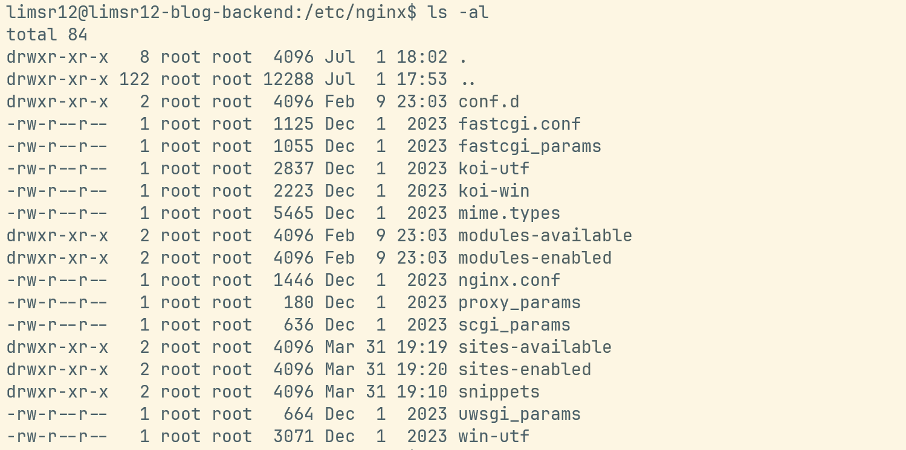

Nginx 공식문서랑 다양한 레퍼런스를 찾아보면서 어떤 역할을 하고 어떻게 사용하는 지 감은 잡은 것 같다.
실제로 `conf` 파일을 따라 설정해보고, 간단한 기본 문법과 구조는 이해한 것 같다.

그런데 클로드가 알려주는 내용이나 다른 기술 블로그 내용을 참고하다보면 `nginx.conf`를 수정하라고 하기도 하고 `sites-available/` 하위 설정을 수정하라고 하기도 한다.



실제로 배포환경에 SSH 접속해서 `/etc/nginx/` 경로를 확인해보면 다양한 디렉토리와 파일을 볼 수 있는데, 각각의 역할과 기능을 제대로 짚고 넘어가지 않으니 더 헷갈리는 것 같다.

# /etc/nginx/ 전체 구조

```
/etc/nginx/
├── nginx.conf                  ← 메인 설정 (거의 안 건드린다고 함)
├── sites-available/            ← 사이트별 설정 파일 보관소
│   ├── default
│   └── api.limsr12.com         ← 내 블로그
├── sites-enabled/              ← 실제로 Nginx가 읽는 곳 (심볼릭 링크)
│   ├── default -> ../sites-available/default
│   └── api.limsr12.com -> ../sites-available/api.limsr12.com
├── conf.d/                     ← 추가 설정 파일 (*.conf 자동 로드)
├── snippets/                   ← 재사용 설정 조각
├── modules-available/          ← 모듈 보관소
├── modules-enabled/            ← 활성화된 모듈 (심볼릭 링크)
├── mime.types                  ← MIME 타입 매핑
├── fastcgi_params              ← FastCGI 파라미터
├── proxy_params                ← 프록시 파라미터
├── scgi_params                 ← SCGI 파라미터
└── uwsgi_params                ← uWSGI 파라미터
```

위와 같이 정리해볼 수 있는데, 각 파일의 역할과 기능에 대해 조금 더 자세히 정리해봤다.

## `nginx.conf`

`nginx.conf`는 **nginx 프로세스 전체의 동작 방식을 정의하고 나머지 설정 파일을 불러오는** 뼈대 파일 역할을 한다.

즉 nginx 최상위 설정으로, 이 파일이 나머지를 전부 include로 불러오는 구조다!

```
main (파일 최상단, 블록으로 감싸지지 않은 영역)
├── events { }
├── http {
│     ├── server {
│     │     └── location { }
│     │   }
│   }
├── stream { }   # TCP/UDP 프록시용, 선택
└── mail { }     # 메일 프록시용, 선택
```

파일 내부를 보면 위와 같은 형태로 이루어져 있다.

### 1. main 컨텍스트

> 프로세스 수준 설정

파일 최상단의, 아무 블록에도 속하지 않는 영역이다. nginx 마스터 프로세스가 어떻게 뜰지 결정할 때 이곳을 참조한다고 한다. (nginx는 Master/Slave 프로세스 구조다)

```nginx
user www-data;                    # 워커 프로세스를 실행할 OS 계정
worker_processes auto;            # 워커 프로세스 개수 (auto = CPU 코어 수)
pid /run/nginx.pid;               # 마스터 프로세스 PID 파일 경로
error_log /var/log/nginx/error.log warn;   # 에러 로그 위치와 레벨
include /etc/nginx/modules-enabled/*.conf; # 동적 모듈 로드
```

### 2. events 블록

> 연결 처리 방식

```nginx
events {
    worker_connections 768;  # 워커 1개당 동시 처리 가능한 커넥션 수
    multi_accept on;          # 새 연결이 여러 개면 한 번에 다 수락
    use epoll;                # 이벤트 모델 (리눅스는 epoll, 보통 생략해도 자동 선택)
}
```

nginx가 어떻게 커넥션을 받아들일지 정하는 블록이며, nginx의 이벤트 기반 아키텍처를 튜닝하는 지점이다.

#### 2-1. 커넥션이란 무엇인가

여기서 말하는 **커넥션**은 **TCP 연결 하나**, **OS 관점**에서는 **소켓 하나(=File Descriptor)**를 의미한다.

리눅스는 소켓을 파일처럼 취급하기 때문에, 클라이언트가 접속하면 커널이 `accept()`를 통해 정수 하나를 반환하고, 이후 그 연결에 대한 읽기/쓰기는 전부 이 정수 하나를 통해 이루어진다.

그래서 커넥션 개수는 곧 프로세스가 열어둔 fd 개수인데,

Debian/Ubuntu 패키지 관리자가 넣어둔 값에 의해 768 혹은 1024로 제한된다.
커넥션 1개 = fd 1개이므로 worker_connections가 fd 한도를 넘으면 nginx가 연결을 수락하지 못하고 에러 로그에 이런 메시지가 찍힙니다.

```
[alert] 1234#0: accept4() failed (24: Too many open files)
```

그래서 위 events 블록에도 `worker_connections`는 768로 찍혀있는 것을 볼 수 있다.

#### 2-2. 이벤트란 무엇인가

이벤트는 커널이 nginx에게 알려주는 **"이 fd가 지금 읽을/쓸 준비가 됐다"**는 상태 변화 알림이다.

다음 예시와 같이 전통적인 모델과 비교해보면 좋을 것 같다.

> 스레드 기반(Apache, Tomcat 기본 설정) 전통 방식

```
연결 1개 -> 스레드 1개 배정
스레드가 read() 호출 -> 데이터 올 때까지 블로킹
```

이 상황에서 연결이 1만 개면 스레드 1만 개가 필요한데, 심지어 스레드 하나 당 스택 메모리 수백 KB에 Context Switching 비용까지 붙어서 무너지기 쉽다는 문제가 있었다. ([C10K문제](https://oliveyoung.tech/2023-10-02/c10-problem/))

> 이벤트 기반(nginx)

아파치 서버와 달리 Nginx는 하나의 `Master process`와 다수의 `Worker process`로 구성되어 있다.

마스터 프로세스는 설정 파일을 읽어서 포트를 바인딩하고 워커 프로세스를 관리한다.

워커 프로세스는 일반적으로 CPU 코어 개수만큼 생성되며, 각각 하나의 단일 스레드로 동작한다. 그런데 하나의 워커 프로세스는 OS에서 지정한 최대 제한만큼 커넥션을 관리할 수 있는데, 이를 위해 일반적으로 (리눅스에서는) epoll API를 사용한다.

다음 예시는 epoll API에 대해 AI에게 물어본 간단한 예제 코드다.

```c
// 개념적으로 이런 구조
epfd = epoll_create();
epoll_ctl(epfd, EPOLL_CTL_ADD, fd, ...);   // 관심 있는 fd 등록

while (1) {
    n = epoll_wait(epfd, events, max, timeout);  // 준비된 fd만 골라서 반환
    for (i = 0; i < n; i++) {
        // 이 fd는 지금 즉시 처리 가능 → 블로킹 없이 read/write
        handler(events[i]);
    }
}
```

위 예제처럼 워커 프로세스는 **epoll API를 사용해 등록된 fd 1만개를 감시하다가, 그 중 실제로 준비된 것들만 배열로 반환**한다. 나머지 9,900개가 대기 중이어도 비용이 들지 않는다. 워커 프로세스는 준비된 것만 훑으면서 논블로킹으로 처리하므로, 스레드 하나가 수천 개 연결을 감당할 수 있게 된다.

그런데 하나의 워커 프로세스가 단일 스레드라서, 만약 디스크 I/O 작업이 필요할 경우 워커에 물려있는 커넥션이 전부 블로킹되는 문제가 생길 수 있다. 그래서 nginx는 별도 스레드 풀을 제공하기도 한다.

```nginx
# main 컨텍스트
thread_pool default threads=32 max_queue=65536;

http {
    location /downloads/ {
        aio threads;       # 디스크 읽기를 스레드 풀에 위임
        directio 4m;       # 4MB 이상 파일은 페이지 캐시 우회
    }
}
```

- `threads=32` : 워커 프로세스마다 생성 가능한 스레드 수
- `max_queue=65536` : 대기 작업 큐 제한
- `directio 4m` : 지정 크기 이상의 파일은 페이지 캐시를 우회해 직접 읽도록 해 대용량 파일이 캐시를 다 밀어내는 cache pollution을 막아줌

### 3. http 블록

> 웹/프록시 관련 전역 기본값

```nginx
http {
    # MIME 타입 매핑
    include       /etc/nginx/mime.types;
    default_type  application/octet-stream;

    # 파일 전송 최적화
    sendfile        on;      # 커널 레벨에서 파일 전송 (유저 공간 복사 생략)
    tcp_nopush      on;      # 헤더와 본문을 한 패킷에 모아 전송
    tcp_nodelay     on;      # Nagle 알고리즘 비활성화 (지연 감소)
    keepalive_timeout  65;
    types_hash_max_size 2048;
    server_tokens   off;     # 응답 헤더에서 nginx 버전 숨김 (보안)

    # 액세스 로그 포맷 정의
    log_format  main  '$remote_addr - $remote_user [$time_local] "$request" '
                      '$status $body_bytes_sent "$http_referer" '
                      '"$http_user_agent" "$http_x_forwarded_for"';
    access_log  /var/log/nginx/access.log  main;

    # 압축
    gzip on;
    gzip_types text/plain application/json application/javascript text/css;

    # 실제 사이트 설정들을 여기서 불러옴
    include /etc/nginx/conf.d/*.conf;
    include /etc/nginx/sites-enabled/*;
}
```

마지막의 include 두 줄을 보면 `/etc/nginx/` 하위의 파일을 불러오고 있다.
그래서 관례로는 `nginx.conf` 에는 server{} 블록을 직접 쓰지 않고 `conf.d/`나 `sites-available/`에 별도 파일로 두고 `nginx.conf`는 그 파일을 참조하는 형태로 사용한다고 한다.

## `sites-available/`, `sites-enabled/`

우선 `sites-available/`, `sites-enabled/`는 nginx 공식 제공 기능이 아니라고 한다. Debian 패키징 팀이 Apache의 관례(`a2ensite`/`a2dissite`)를 nginx 패키지에 그대로 가져온 것이라고 한다.

`sites-available/` 은 설정 파일을 보관만 하는 공간이다.
여기에 파일을 만들어도 nginx 는 읽지 않는다!

`sites-enabled/` 는 nginx가 실제로 로드하는 곳이다.
`nginx.conf` 에서 `include /etc/nginx/sites-enabled/*` 와 같이 이 디렉토리를 읽는다!

활성화/비활성화 흐름은 다음과 같다.

```nginx
# 활성화: sites-available → sites-enabled로 심볼릭 링크 생성
sudo ln -s /etc/nginx/sites-available/api.limsr12.com /etc/nginx/sites-enabled/

# 비활성화: 링크만 삭제 (원본은 보존)
sudo rm /etc/nginx/sites-enabled/api.limsr12.com

# 설정 수정은 항상 sites-available의 원본 파일에서
sudo nano /etc/nginx/sites-available/api.limsr12.com
```

> sites-available/ 에 파일을 만들고 sites-enabled/ 로 심볼릭 링크를 걸어줘서 nginx가 읽을 수 있는 것!

## `conf.d/`

`sites-available`과 달리 이쪽은 nginx가 직접 밀고 있는 방식이다.

`nginx.conf` 에서 `include /etc/nginx/conf.d/*.conf` 로 이 디렉토리도 읽는다!
`conf.d` 에 .conf 확장자로 파일을 넣으면 알아서 로드되며 심볼릭 링크같은 별도 작업이 필요 없다.

정리하면 `sites-available/` + `sites-enabled/` 는 Debian/Ubuntu의 관례이고, `conf.d/` 는 RedHat/CentOS 계열과 Docker 공식 Nginx 이미지의 관례이다.

| 방식                                  | 활성화/비활성화       | 주로 사용하는 환경                |
| ------------------------------------- | --------------------- | --------------------------------- |
| `sites-available/` + `sites-enabled/` | 심볼릭 링크 생성/삭제 | Ubuntu 서버 직접 설치             |
| `conf.d/`                             | 파일 추가/삭제        | Docker, CentOS, 공식 Nginx 이미지 |

추가로, include 위치가 http 블록 안이기 때문에, 둘 중 어느 곳에 설정 파일을 만들더라도 http 블록에서 허용하는 문법만 사용 가능하다.

## `snippets/`

여러 사이트에서 공통으로 쓰는 설정 조각을 모아두는 곳이다.

`nginx.conf` 에서 `snippets/`를 가리키는 include는 없기 때문에 SSL 공통 설정, 보안 헤더 같은 것들을 넣어두고 직접 include로 가져다 써야 한다.

```nginx
# /etc/nginx/snippets/ssl-params.conf (예시)
ssl_protocols TLSv1.2 TLSv1.3;
ssl_ciphers HIGH:!aNULL:!MD5;
```

```nginx
server {
    include snippets/ssl-params.conf;
}
```

## 나머지 기타 파일들

`mime.types`는 파일 확장자별 Content-Type 매핑이고(.html → text/html 등), `fastcgi_params`, `proxy_params`, `scgi_params`, `uwsgi_params는` 각 프록시 방식에서 공통으로 전달하는 헤더/파라미터 기본값이라고 한다.
이 파일들은 직접 수정할 일이 거의 없다!

# 그래서 정리! 언제 어디를 수정하면 되는가

| 상황                                | 수정할 곳                                            |
| ----------------------------------- | ---------------------------------------------------- |
| 새 사이트/도메인 추가 (Ubuntu 서버) | sites-available/에 파일 생성 → sites-enabled/로 링크 |
| 새 사이트/도메인 추가 (Docker)      | conf.d/에 .conf 파일 추가                            |
| 기존 사이트 설정 변경               | sites-available/의 원본 파일 수정                    |
| 사이트 일시 비활성화                | sites-enabled/의 심볼릭 링크 삭제                    |
| 워커 수, 로그 경로 등 글로벌 설정   | nginx.conf                                           |
| 여러 사이트 공통 설정               | snippets/에 작성 후 include                          |

# 세 가지 질문

1. 이 설정이 nginx 프로세스 전체에 대한 것인가?

워커 개수, 실행 계정, 이벤트 모델 등 `nginx.conf` 설정하는 경우인데, 손댈 일이 거의 없을 듯 하다.

2. 특정 도메인 하나에만 해당하는가?

server_name, 인증서, 프록시 대상 등 `conf.d/도메인.conf` 설정하는 경우로, 일상적인 대부분의 수정이 여기일 것 같다.

3. 두 개 이상의 도메인이 똑같이 쓰는가?

TLS 설정, 보안 헤더, 프록시 헤더 등인데, `snippets/` 로 분리를 고려하면 좋을 것 같다.

# 변경 워크플로우

```bash
# 1. 문법 검사
sudo nginx -t

# 2. 최종 설정 확인 (의도치 않은 파일이 섞이지는 않았는지는지)
sudo nginx -T 2>/dev/null | grep "# configuration file"

# 3. 무중단 반영
sudo systemctl reload nginx

# 4. 실제 응답으로 검증
curl -sI https://api.limsr12.com
```

```bash
docker compose exec nginx nginx -t
docker compose exec nginx nginx -s reload    # 컨테이너 재시작 없이 반영
```
